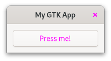
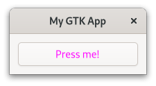
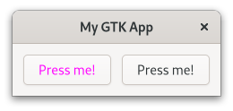
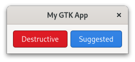
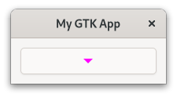
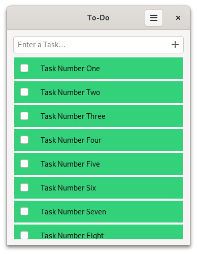
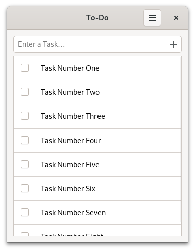

# CSS

当您想改变网站风格时，需要使用 [CSS](https://de.wikipedia.org/wiki/Cascading_Style_Sheets). 同样，GTK 也支持自己的 CSS 变体，以便为应用程序设计样式。

> 在本章中，我们不会对所用的每一种语法进行解释。 如果你是 CSS 的新手，或者需要复习一下，请查看 [MDN Web 文档](https://developer.mozilla.org/en-US/docs/Web/CSS/Syntax)。

比方说，我们有一个按钮，希望将其字体颜色设置为品红色。 每种类型的控件都有一个对应的 CSS 节点。 对于 `gtk::Button`，这个节点被称为 `button`. 因此，我们创建了一个内容如下的 `style.css` 文件：

文件名：<a class=file-link href="https://github.com/gtk-rs/gtk4-rs/blob/master/book/listings/css/1/style.css">listings/css/1/style.css</a>

```css
{{#rustdoc_include ../listings/css/1/style.css}}
```

接下来，我们需要在应用程序的启动步骤中加载 CSS 文件。 像往常一样，控件是在"激活"步骤中创建的。

文件名：<a class=file-link href="https://github.com/gtk-rs/gtk4-rs/blob/master/book/listings/css/1/main.rs">listings/css/1/main.rs</a>

```rust
{{#rustdoc_include ../listings/css/1/main.rs:main}}
```

现在运行应用程序时，我们会发现按钮和窗口上的"关闭"按钮都变成了品红色。 这可能不是我们想要的结果，但我们的 CSS 代码段就是这么做的。 我们没有指定该规则应适用于哪个按钮，因此它同时适用于全部两个按钮。

<div style="text-align:center"></div>

>在使用 CSS 时，`GtkInspector` 可谓得心应手（不仅如此）。 确保您的应用程序窗口处于焦点状态，然后按下  <kbd>Ctrl</kbd> + <kbd>Shift</kbd> + <kbd>D</kbd>. 这时会弹出一个窗口，您可以浏览甚至操作应用程序的状态。 打开 CSS 视图，用以下代码段覆盖按钮颜色。
>
>```css
>button {
>color: blue;
>}
>```
>使用暂停按钮可以切换 CSS 代码的活动状态。

## GTK 实现的样式类

[类选择器](https://developer.mozilla.org/en-US/docs/Web/CSS/Class_selectors)是选择 CSS 规则适用于哪些特定元素的一种方法。 GTK 为许多控件添加了样式类，通常取决于它们的内容。 例如，当 [`gtk::Button`](https://gtk-rs.org/gtk4-rs/stable/latest/docs/gtk4/struct.Button.html#css-nodes) 的内容是一个标签时，它就会获得 `text-button` 样式类。 因此，我们创建了一条新的 CSS 规则，它只适用于样式类为 `text_button` 的按钮节点。


文件名：<a class=file-link href="https://github.com/gtk-rs/gtk4-rs/blob/master/book/listings/css/2/style.css">listings/css/2/style.css</a>

```css
{{#rustdoc_include ../listings/css/2/style.css}}
```

Now only the font of our button becomes magenta.

<div style="text-align:center"></div>

## 添加你自己的样式类

通过 [`add_css_class`](https://gtk-rs.org/gtk4-rs/stable/latest/docs/gtk4/prelude/trait.WidgetExt.html#tymethod.add_css_class)，我们还可以为控件添加自己的样式类。 这种方法的一种使用情况是，当你希望一条规则适用于一组精心挑选的部件时。 例如，我们有两个按钮，但只想让其中一个使用品红色字体。 依靠 GTK 添加的某个样式类是没有用的，因为两个按钮的样式是一样的。 这就是为什么我们要为第一个按钮添加 `button-1` 样式类。

文件名：<a class=file-link href="https://github.com/gtk-rs/gtk4-rs/blob/master/book/listings/css/3/main.rs">listings/css/3/main.rs</a>

```rust
{{#rustdoc_include ../listings/css/3/main.rs:buttons}}
```

然后，我们创建一条 CSS 规则，该规则适用于样式类为 `button-1` 的按钮节点。

文件名：<a class=file-link href="https://github.com/gtk-rs/gtk4-rs/blob/master/book/listings/css/3/style.css">listings/css/3/style.css</a>

```css
{{#rustdoc_include ../listings/css/3/style.css}}
```

我们可以看到，这样只有第一个按钮被染成了品红色。

<div style="text-align:center"></div>


## 指定控件名称

如果您希望您的规则只适用于一个部件，那么使用样式类进行匹配也是可以的。 不过，理想情况下，您应该给控件取一个名字，然后用这个名字进行匹配。 这样，你的意图就会更明确，而不是匹配可适用于多个控件的样式类。

同样，我们有两个按钮，但只想将其中一个按钮染成洋红色。 我们使用 [`set_widget_name`](https://gtk-rs.org/gtk4-rs/stable/latest/docs/gtk4/prelude/trait.WidgetExt.html#tymethod.set_widget_name) 设置第一个按钮的名称。

文件名：<a class=file-link href="https://github.com/gtk-rs/gtk4-rs/blob/master/book/listings/css/4/main.rs">listings/css/4/main.rs</a>

```rust
{{#rustdoc_include ../listings/css/4/main.rs:buttons}}
```

然后，创建一条适用于名称为 `button-1` 的按钮节点的 CSS 规则。 名称在 `#` 符号后指定。

文件名：<a class=file-link href="https://github.com/gtk-rs/gtk4-rs/blob/master/book/listings/css/4/style.css">listings/css/4/style.css</a>

```css
{{#rustdoc_include ../listings/css/4/style.css}}
```

同样，样式规则只适用于第一个按钮。

<div style="text-align:center"></div>


## GTK 提供的 CSS 规则

某些样式非常常见，GTK 为其提供了 CSS 规则。 例如，如果您想在按钮上标明 "破坏性动作"或"建议的动作"，您就不必提供自己的 CSS 规则。 您只需在按钮上添加 "破坏性动作(destructive-action)"或 "建议的动作(suggested-action)"样式类即可。 大多数控件都会在 [CSS 节点](https://gtk-rs.org/gtk4-rs/stable/latest/docs/gtk4/struct.Button.html#css-nodes)下的文档中记录这些规则。

文件名：<a class=file-link href="https://github.com/gtk-rs/gtk4-rs/blob/master/book/listings/css/5/main.rs">listings/css/5/main.rs</a>

```rust
{{#rustdoc_include ../listings/css/5/main.rs:buttons}}
```

<div style="text-align:center"></div>

## 界面生成器

我们还可以使用界面生成器添加样式类。 只需在 widget 中添加 `<style>` 元素即可。 `<style>` 元素与 [`gtk::Widget`](https://gtk-rs.org/gtk4-rs/stable/latest/docs/gtk4/struct.Widget.html#gtkwidget-as-gtkbuildable) 一起记录。 再次添加破坏性和建议的按钮，看起来就像这样：

文件名：<a class=file-link href="https://github.com/gtk-rs/gtk4-rs/blob/master/book/listings/css/6/window/window.ui">listings/css/6/window/window.ui</a>

```xml
{{#rustdoc_include ../listings/css/6/window/window.ui}}
```


## 伪类

有时，你希望 CSS 规则在比样式类更精确的条件下应用。 这就是[伪类](https://developer.mozilla.org/en-US/docs/Web/CSS/Pseudo-classes)的用武之地。 让我们使用名称为 `button-1` 的按钮来演示这一概念。

文件名：<a class=file-link href="https://github.com/gtk-rs/gtk4-rs/blob/master/book/listings/css/7/window/window.ui">listings/css/7/window/window.ui</a>

```xml
{{#rustdoc_include ../listings/css/7/window/window.ui}}
```

通过添加伪类 `hover`，我们表示希望这条规则只适用于当鼠标指针悬停在名称为 `button-1` 的按钮节点。

文件名：<a class=file-link href="https://github.com/gtk-rs/gtk4-rs/blob/master/book/listings/css/7/style.css">listings/css/7/style.css</a>

```css
{{#rustdoc_include ../listings/css/7/style.css}}
```

现在，如果我们将鼠标悬停在按钮上，就会发现在一瞬间按钮的背景变成了黄色，文字变成了品红色。 当我们移除光标后，按钮又恢复到原来的状态。

<div style="text-align:center">
 <video autoplay muted loop>
  <source src="vid/css_6.webm" type="video/webm">
  <p>A video which shows that hovering over one button makes its background yellow and text red</p>
 </video>
</div>

## 节点

在前面的示例中，一个部件总是对应一个 CSS 节点。 但情况并非总是如此。 例如，[`gtk::MenuButton`](https://gtk-rs.org/gtk4-rs/stable/latest/docs/gtk4/struct.MenuButton.html)  就有多个 CSS 节点。 

首先，我们创建一个 `MenuButton`.


文件名：<a class=file-link href="https://github.com/gtk-rs/gtk4-rs/blob/master/book/listings/css/8/window/window.ui">listings/css/8/window/window.ui</a>

```xml
{{#rustdoc_include ../listings/css/8/window/window.ui}}
```
您可以让菜单按钮( `MenuButton` )显示图标或标签。 如果您选择两者都不显示，就像我们目前所做的那样，它将显示一个箭头图像。

[CSS 节点](https://gtk-rs.org/gtk4-rs/stable/latest/docs/gtk4/struct.MenuButton.html#css-nodes)的继承树就显示了这种情况：

```
menubutton
╰── button.toggle
    ╰── <content>
         ╰── [arrow]
```

我们看到，`menubutton` 节点有子节点，而子节点本身也有子节点和附加样式类。 现在我们知道，必须添加一条适用于箭头(`arrow`)节点的 CSS 规则，它是 `menubutton` 的子节点。

文件名：<a class=file-link href="https://github.com/gtk-rs/gtk4-rs/blob/master/book/listings/css/8/style.css">listings/css/8/style.css</a>

```css
{{#rustdoc_include ../listings/css/8/style.css}}
```

的确，我们得到了一个带有品红色箭头的 `MenuButton`。

<div style="text-align:center"></div>


## 设置 CSS 名称并使用导出颜色

我们已经学习了如何使用伪类为部件实例命名。 但如果我们有一个自定义控件，并想引用它的所有实例，该怎么办呢？ 让我们通过再次用待办事项应用来看看如何处理这种情况。

`TaskRow` 类继承于 `gtk::Box`，因此我们可以只匹配节点 `box`. 但是，在这种情况下，我们也会匹配其他 `gtk::Box` 的实例。 我们要做的是为 `TaskRow` 赋予自己的 CSS 名称。 调用 [`set_css_name` ](https://gtk-rs.org/gtk4-rs/stable/latest/docs/gtk4/subclass/widget/trait.WidgetClassExt.html#method.set_css_name) 时，我们会更改控件类的 CSS 节点名称。 在我们的例子中，`TaskRow` 就对应于节点 `task-row`.

文件名：<a class=file-link href="https://github.com/gtk-rs/gtk4-rs/blob/master/book/listings/todo/3/task_row/imp.rs">listings/todo/3/task_row/imp.rs</a>

```rust
{{#rustdoc_include ../listings/todo/3/task_row/imp.rs:object_subclass}}
```

现在该如何处理新的节点名称呢？ 让我们再次更改背景颜色，但这次有点不一样，我们将使用名为 `success_color` 的颜色。


文件名：<a class=file-link href="https://github.com/gtk-rs/gtk4-rs/blob/master/book/listings/todo/3/resources/style.css">listings/todo/3/resources/style.css</a>

```css
{{#rustdoc_include ../listings/todo/3/resources/style.css}}
```

GTK 的默认(`Default`)样式表为各种用途提供了预定义的颜色。 在[源代码](https://gitlab.gnome.org/GNOME/gtk/-/blob/b2c227e9c57839a2a4e24462a71ae0bad9a95264/gtk/theme/Default/_colors-public.scss)中，我们可以找到 `success_color` 颜色，在实际场景中，它用来表示成功。 然后，我们可以通过在名称前添加 @ 来访问预定义的颜色。

我们还必须在 `resources.gresource.xml` 中添加 `style.css`.

文件名：<a class=file-link href="https://github.com/gtk-rs/gtk4-rs/blob/master/book/listings/todo/3/resources/resources.gresource.xml">listings/todo/3/resources/resources.gresource.xml</a>

```diff
 <?xml version="1.0" encoding="UTF-8"?>
 <gresources>
   <gresource prefix="/org/gtk_rs/Todo3/">
     <file compressed="true" preprocess="xml-stripblanks" alias="gtk/help-overlay.ui">shortcuts.ui</file>
     <file compressed="true" preprocess="xml-stripblanks">task_row.ui</file>
     <file compressed="true" preprocess="xml-stripblanks">window.ui</file>
+    <file compressed="true">style.css</file>
   </gresource>
 </gresources>
```

此外，我们还在 `connect_startup` 中调用了 `load_css()`.


文件名：<a class=file-link href="https://github.com/gtk-rs/gtk4-rs/blob/master/book/listings/todo/3/main.rs">listings/todo/3/main.rs</a>

```rust
{{#rustdoc_include ../listings/todo/3/main.rs:connect_startup}}
```

`load_css()` 与本章开头显示的非常相似。 不过，这次我们使用 `load_from_resource()` 来加载样式。

```rust
{{#rustdoc_include ../listings/todo/3/main.rs:load_css}}
```

这就是更改后的任务行的样子。 也许最好立即还原……

<div style="text-align:center"></div>

## 改造待办事项应用

幸运的是，在我们的待办事项应用程序中找到 CSS 的实际用途并不难。 到目前为止，不同的任务还没有很好地分隔开来。 我们可以通过在 `tasks_list` 中添加 `frame` 和分隔符(`separators`)样式类来改变这种状况。

文件名：<a class=file-link href="https://github.com/gtk-rs/gtk4-rs/blob/master/book/listings/todo/4/resources/task_row.ui">listings/todo/4/resources/window.ui</a>

```diff
 <object class="GtkListView" id="tasks_list">
   <property name="valign">start</property>
+  <style>
+    <class name="frame"/>
+    <class name="separators"/>
+  </style>
 </object>
```

<div style="text-align:center"></div>


## 结论

定义 CSS 规则的方法有很多。 让我们简要回顾一下所学的语法。 下面的规则匹配节点 `arrow`，它是名称为 `button-1`、样式类为 `toggle` 和 `text-button` 的按钮节点的子对象。 当我们将鼠标悬停在箭头上时，该规则就会实际应用。

```css
button#button-1.toggle.text-button arrow:hover {
  color: magenta;
}
```

当规则应用时，颜色参数将被设置为品红色。 您可以在 GTK [文档](https://docs.gtk.org/gtk4/css-properties.html#gtk-css-properties)中找到支持参数的完整列表。
