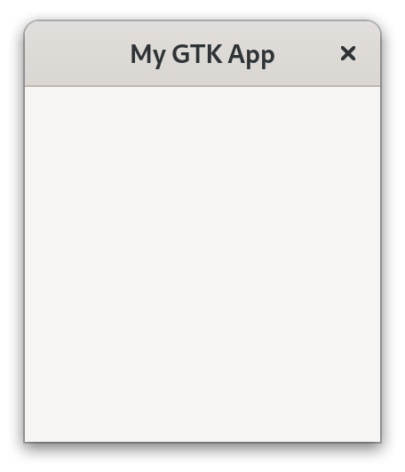

# Hello World!

现在我们已经安装好了，让我们开始吧！

至少，我们需要创建一个带有[应用程序 ID](https://developer.gnome.org/documentation/tutorials/application-id.html) 的 [`gtk::Application`](https://gtk-rs.org/gtk4-rs/stable/latest/docs/gtk4/struct.Application.html) 实例。 为此，我们使用了许多 `gtk-rs` 对象都支持的 [builder 模式](https://rust-unofficial.github.io/patterns/patterns/creational/builder.html)。 请注意，我们还导入了 prelude 以将必要的 trait 引入。

文件名：<a class=file-link href="https://github.com/gtk-rs/gtk4-rs/blob/master/book/listings/hello_world/1/main.rs">listings/hello_world/1/main.rs</a>

```rust
{{#rustdoc_include ../listings/hello_world/1/main.rs}}
```

它构建正常，但终端中显示一条警告。

```
GLib-GIO-WARNING: Your application does not implement g_application_activate()
and has no handlers connected to the 'activate' signal. It should do one of these.
```

GTK 告诉我们，应该在其 `activate`步骤中调用某些内容。

所以让我们在那里创建一个 [`gtk::ApplicationWindow`](https://gtk-rs.org/gtk4-rs/stable/latest/docs/gtk4/struct.ApplicationWindow.html)。

文件名：<a class=file-link href="https://github.com/gtk-rs/gtk4-rs/blob/master/book/listings/hello_world/2/main.rs">listings/hello_world/2/main.rs</a>

```rust
{{#rustdoc_include ../listings/hello_world/2/main.rs}}
```
这样好多了！

<div style="text-align:center"></div>

通常，我们希望用户能够与界面进行交互。 

此外，章节的名称表示软件将包含 “Hello World！”。

文件名：<a class=file-link href="https://github.com/gtk-rs/gtk4-rs/blob/master/book/listings/hello_world/3/main.rs">listings/hello_world/3/main.rs</a>

```rust
{{#rustdoc_include ../listings/hello_world/3/main.rs:build_ui}}
```

> 如果您仔细查看这段代码，您会注意到它的右上角有一个小眼睛符号。 按下它后，您可以看到完整代码。 我们将在整本书中使用它来隐藏那些对传达信息并不重要的细节。 如果您想按照本书一步步编写程序，请注意这一点。 在这里，我们隐藏了我们引入`gtk::Button`的内容。

现在有一个按钮，如果我们单击它，它的标签将变为 “Hello World！”。

<div style="text-align:center">
 <video autoplay muted loop>
  <source src="vid/hello_world_button.webm" type="video/webm">
  <p>A video which shows that pressing on the button changes it's label</p>
 </video>
</div>

创建我们的第一个 `gtk-rs` 应用程序不是很难，对吧？ 现在让我们更好地了解我们到底在这里做了什么。

