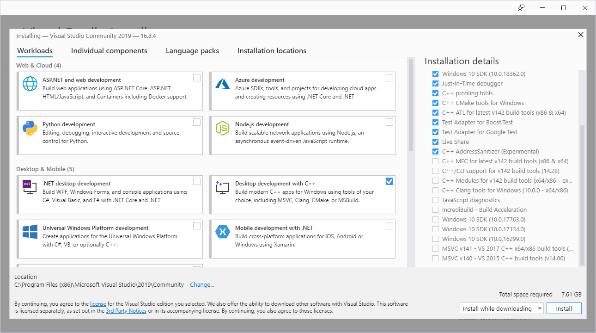

# Windows

在 Windows 计算机上做准备时，您必须在使用 **MSVC 工具链**或 **GNU 工具链**之间做出决定。 如有疑问，请选择 MSVC，因为这是 Windows 上的默认设置。 如果您依赖只能使用 GNU 工具链编译的库，您将需要使用 GNU 工具链。

## 安装 Rustup

通过 [rustup](https://rustup.rs/) 安装 Rust 工具链。

## 安装 GTK 4

<details>
<summary>使用gvsbuild 和 MSVC构建GTK 4 (推荐)</summary>

### 将 Rust 工具链设为 MSVC

通过执行以下命令告诉 Rust 使用 MSVC：

```
rustup default stable-msvc
```

请注意，这不会安装 MSVC 工具链。如果您还没有，则需要[单独安装它](https://learn.microsoft.com/zh-cn/windows/dev-environment/rust/setup)。

### 构建 GTK 4

按照 [`gvsbuild` 文档构建 GTK 4](https://github.com/wingtk/gvsbuild#development-environment)。请务必构建正确的版本：

```
gvsbuild build gtk4
```

### 更新环境变量

1. 打开开始菜单
2. 搜索“高级系统设置”
3. 单击 '环境变量...'
4. 确保存在名为`PKG_CONFIG_PATH``C:\gtk-build\gtk\x64\release\lib\pkgconfig` 的用户环境变量
5. 编辑名为`Path`的变量并添加 `C:\gtk-build\gtk\x64\release\bin` 到其中
6. 确保有一个名为 `Lib` 的用户环境变量并包含`C:\gtk-build\gtk\x64\release\lib` （如果已存在，则向现有变量添加新值）

您现在可以继续进行[项目设置](https://mario-hero.github.io/gtk-book-zh_cn/project_setup.html)。

</details>

<details>
<summary>使用 MSVC 手动构建 GTK 4</summary>

如果使用 `gvsbuild` 无法正常构建 （或者您想要自定义构建），则可以手动构建 GTK 4 和您需要的最小依赖项。

### 将 Rust 工具链设置为 MSVC

通过执行以下命令，将 Rust 工具链设置为 MSVC：

```
rustup default stable-msvc
```

### Visual Studio

从 [visualstudio.microsoft.com](https://visualstudio.microsoft.com/zh-hans/vs/community/) 安装 Visual Studio Community。 确保在安装过程中选中“使用 C++ 的桌面开发”选项。

<div style="text-align:center"></div>

### Git

从 [gitforwindows.org](https://gitforwindows.org/) 下载 git.

### CMake

从 [https://cmake.org/download/](https://cmake.org/download/) 下载 CMake.

### Python

从 [python.org](https://www.python.org/downloads) 下载 Python.
确保在安装过程中选择将 Python 添加到您的 Path.

### Meson

通过执行以下命令安装 meson：

```powershell
pip install meson ninja
```

### Gettext 0.21

从 [mlocati.github.io](https://mlocati.github.io/articles/gettext-iconv-windows.html) 下载 Gettext 0.21.
确保选择静态链接版本。

### Pkg-config

从 [sourceforge.net](https://sourceforge.net/projects/pkgconfiglite/) 下载 pkg-config-lite。 
然后解压到 `C:/`, 使可执行文件位于 `C:\pkg-config-lite-0.28-1\bin`.

### 更新环境变量

1. 转到设置 -> 搜索并打开 `高级系统设置` -> 点击 `环境变量` 按钮
2. 选择`Path` -> 点击`编辑` -> 添加以下条目：

```
C:\pkg-config-lite-0.28-1\bin
C:\gnome\bin
```

3. 返回到 `环境变量`
4. 在 `用户变量`下点击`新建` 并添加:

- 环境变量名称: `PKG_CONFIG_PATH`
- 环境变量值: `C:\gnome\lib\pkgconfig`

### 编译安装 GTK 4

从 Windows 开始菜单中，搜索 `x64 Native Tools Command Prompt for VS`。 这将打开一个配置为使用 MSVC x64 工具的终端。 从那里，运行以下命令：

```cmd
cd /
git clone https://gitlab.gnome.org/GNOME/gtk.git --depth 1
git clone https://gitlab.gnome.org/GNOME/libxml2.git --depth 1
git clone https://gitlab.gnome.org/GNOME/librsvg.git --depth 1

:: 确保cmd在搜索pkg-config时能找到pkg-config-lite
where pkg-config

:: 确保setuptools可用。
pip install setuptools

cd gtk
meson setup builddir --prefix=C:/gnome -Dbuild-tests=false -Dmedia-gstreamer=disabled
meson install -C builddir
cd /

cd libxml2
cmake -S . -B build -D CMAKE_BUILD_TYPE=Release -D CMAKE_INSTALL_PREFIX=C:\gnome -D LIBXML2_WITH_ICONV=OFF -D LIBXML2_WITH_LZMA=OFF -D LIBXML2_WITH_PYTHON=OFF -D LIBXML2_WITH_ZLIB=OFF
cmake --build build --config Release
cmake --install build
cd /

cd librsvg/win32
nmake /f generate-msvc.mak generate-nmake-files
nmake /f Makefile.vc CFG=release install PREFIX=C:\gnome
cd /
```

您现在可以继续进行[项目设置](https://mario-hero.github.io/gtk-book-zh_cn/project_setup.html)。

</details>

<details>

<summary>使用 MSYS2 和 GNU 工具链安装 GTK 4</summary>

### 安装 Rustup

通过 [rustup](https://rustup.rs/) 安装 rust 工具链。

### 从 MSVC 工具链中去除残留物

如果您以前使用过 MSVC 工具链，请确保在安装过程中还原您对环境变量所做的所有更改。

### MSYS2

从 [www.msys2.org](https://www.msys2.org/) 安装 MSYS2

### 安装 GTK 4

从 Windows 开始菜单，搜索 `MSYS2 MinGW 64-bit`.
这将打开一个配置为使用 MinGW x64 工具的终端。

在终端中，执行以下命令以安装`GTK 4`、`pkgconf` 和 `gcc`：

```sh
pacman -S mingw-w64-x86_64-gtk4 mingw-w64-x86_64-gettext mingw-w64-x86_64-libxml2 mingw-w64-x86_64-librsvg mingw-w64-x86_64-pkgconf mingw-w64-x86_64-gcc
```

### 更新 `Path` 环境变量

1. 转到设置 -> 搜索并打开 `高级系统设置` -> 点击 `环境变量` 按钮
2. 选择 `Path` -> 点击 `编辑` -> 添加以下三个条目：

```
C:\msys64\mingw64\include
C:\msys64\mingw64\bin
C:\msys64\mingw64\lib
```

### 为 Rust 设置 GNU 工具链

Windows 上的默认工具链是 `stable-msvc`.
要切换到 `stable-gnu`，请从终端运行以下命令：

1. `rustup toolchain install stable-gnu`
2. `rustup default stable-gnu`

请注意，此命令将来可能会更改。 如果它失效了，请在我们的 repo 上打开一个 [issue](https://github.com/gtk-rs/gtk4-rs/issues/new/choose)。

您现在可以继续进行[项目设置](https://mario-hero.github.io/gtk-book-zh_cn/project_setup.html)。

</details>
