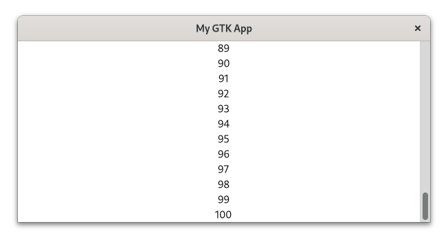
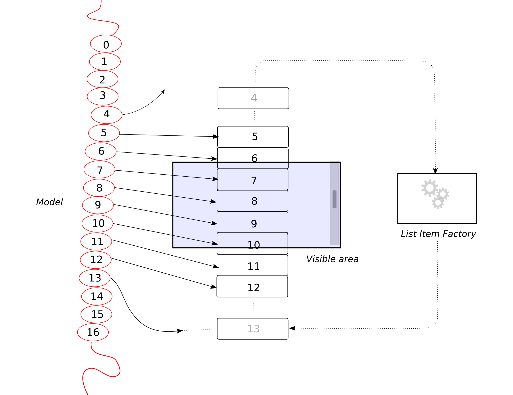
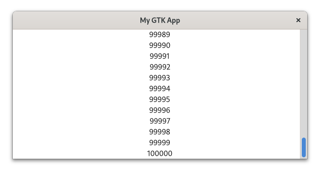

# 列表控件

有时，您想以某种排列方式显示元素列表。[`gtk::ListBox`](https://gtk-rs.org/gtk4-rs/stable/latest/docs/gtk4/struct.ListBox.html) 和 [`gtk::FlowBox`](https://gtk-rs.org/gtk4-rs/stable/latest/docs/gtk4/struct.FlowBox.html) 是两个容器部件，可以让您做到这一点。 `ListBox` 描述的是垂直列表，而 `FlowBox` 描述的是网格。

Sometimes you want to display a list of elements in a certain arrangement.
[`gtk::ListBox`](https://gtk-rs.org/gtk4-rs/stable/latest/docs/gtk4/struct.ListBox.html) and [`gtk::FlowBox`](https://gtk-rs.org/gtk4-rs/stable/latest/docs/gtk4/struct.FlowBox.html) are two container widgets which allow you to do this.
`ListBox` describes a vertical list and `FlowBox` describes a grid.

让我们通过在 `ListBox` 中添加标签来探索这一概念。 标签将显示从 0 到 100 的整数。

文件名：<a class=file-link href="https://github.com/gtk-rs/gtk4-rs/blob/master/book/listings/list_widgets/1/main.rs">listings/list_widgets/1/main.rs</a>

```rust
{{#rustdoc_include ../listings/list_widgets/1/main.rs:list_box}}
```

我们不能同时显示这么多部件。 因此，我们将 `ListBox` 添加到 [`gtk::ScrolledWindow`](https://gtk-rs.org/gtk4-rs/stable/latest/docs/gtk4/struct.ScrolledWindow.html) 中。 现在我们可以滚动浏览我们的元素了。

文件名：<a class=file-link href="https://github.com/gtk-rs/gtk4-rs/blob/master/book/listings/list_widgets/1/main.rs">listings/list_widgets/1/main.rs</a>

```rust
{{#rustdoc_include ../listings/list_widgets/1/main.rs:scrolled_window}}
```

<div style="text-align:center"></div>

## Views

这很简单。 不过，目前我们为每个元素创建一个小部件。 由于每个窗口小部件都会占用一些资源，因此很多窗口小部件会导致用户界面反应变慢。 根据部件类型的不同，即使有成千上万个元素也可能不是问题。 但是，我们怎么可能处理社交媒体时间线中无数的帖子呢？

我们改用可扩展列表！

- **模型(model)**保存我们的数据，对其进行过滤并描述其顺序。
- **列表项工厂(list item factory)**定义了数据如何转换为控件。
- **视图(view)**指定控件的排列方式。

使这一概念具有可扩展性的是，GTK 只需创建略多于我们目前所能看到的控件。 当我们滚动浏览元素时，不可见的控件将被重复使用。 下图演示了实际操作过程。

<div style="text-align:center"></div>

100000 个元素是 `ListBox` 难以承受的，因此让我们用它来演示可扩展列表。

我们首先定义并填充模型。 该模型是 [`gio::ListStore`](https://gtk-rs.org/gtk-rs-core/stable/latest/docs/gio/struct.ListStore.html) 的一个实例。 这里的主要限制是 `gio::ListStore` 只接受 GObject. 因此，让我们创建一个用数字初始化的自定义 GObject `IntegerObject`.

文件名：<a class=file-link href="https://github.com/gtk-rs/gtk4-rs/blob/master/book/listings/list_widgets/2/integer_object/mod.rs">listings/list_widgets/2/integer_object/mod.rs</a>

```rust
{{#rustdoc_include ../listings/list_widgets/2/integer_object/mod.rs:integer_object}}
#
```

`number` 代表 `IntegerObject` 的内部状态。

文件名：<a class=file-link href="https://github.com/gtk-rs/gtk4-rs/blob/master/book/listings/list_widgets/2/integer_object/imp.rs">listings/list_widgets/2/integer_object/imp.rs</a>

```rust
{{#rustdoc_include ../listings/list_widgets/2/integer_object/imp.rs:integer_object}}
#
```

现在我们用 0 到 100000 的整数填充模型。 请注意，模型只处理数据。 这里没有提及标签或任何其他控件。

文件名：<a class=file-link href="https://github.com/gtk-rs/gtk4-rs/blob/master/book/listings/list_widgets/2/main.rs">listings/list_widgets/2/main.rs</a>

```rust
{{#rustdoc_include ../listings/list_widgets/2/main.rs:model}}
```

`ListItemFactory` 负责处理控件及其与模型的关系。 在这里，我们使用了  [`SignalListItemFactory`](https://gtk-rs.org/gtk4-rs/stable/latest/docs/gtk4/struct.SignalListItemFactory.html) ，它可以为 `ListItem` 生命周期中的每一个相关步骤发出一个信号。 当需要创建新的部件时，"setup"（设置）信号就会发出。 我们连接到该信号，为每个请求的部件创建一个标签。

文件名：<a class=file-link href="https://github.com/gtk-rs/gtk4-rs/blob/master/book/listings/list_widgets/2/main.rs">listings/list_widgets/2/main.rs</a>

```rust
{{#rustdoc_include ../listings/list_widgets/2/main.rs:factory_setup}}
```

在“绑定”步骤中，我们将模型中的数据绑定到各个列表项。

文件名：<a class=file-link href="https://github.com/gtk-rs/gtk4-rs/blob/master/book/listings/list_widgets/2/main.rs">listings/list_widgets/2/main.rs</a>

```rust
{{#rustdoc_include ../listings/list_widgets/2/main.rs:factory_bind}}
```

我们只希望单个项目可选，因此选择了  [`SingleSelection`](https://gtk-rs.org/gtk4-rs/stable/latest/docs/gtk4/struct.SingleSelection.html)。 其他选项是多选（[`MultiSelection`](https://gtk-rs.org/gtk4-rs/stable/latest/docs/gtk4/struct.MultiSelection.html)）和不选（[`NoSelection`](https://gtk-rs.org/gtk4-rs/stable/latest/docs/gtk4/struct.NoSelection.html)）。然后，我们将模型和工厂传递给  [`ListView`](https://gtk-rs.org/gtk4-rs/stable/latest/docs/gtk4/struct.ListView.html)。

文件名：<a class=file-link href="https://github.com/gtk-rs/gtk4-rs/blob/master/book/listings/list_widgets/2/main.rs">listings/list_widgets/2/main.rs</a>

```rust
{{#rustdoc_include ../listings/list_widgets/2/main.rs:selection_list}}
```

每个 `ListView` 都必须是 `ScrolledWindow` 的直接子窗口，因此我们要将其添加到 `ScrolledWindow` 中。

文件名：<a class=file-link href="https://github.com/gtk-rs/gtk4-rs/blob/master/book/listings/list_widgets/2/main.rs">listings/list_widgets/2/main.rs</a>

```rust
{{#rustdoc_include ../listings/list_widgets/2/main.rs:scrolled_window}}
```

现在，我们可以轻松地滚动浏览一长串整数。

<div style="text-align:center"></div>

让我们看看还能做些什么。 我们可能想在每次激活行时增加数字。 为此，我们首先要为 `IntegerObject` 添加 `increase_number` 方法。

文件名：<a class=file-link href="https://github.com/gtk-rs/gtk4-rs/blob/master/book/listings/list_widgets/3/integer_object/mod.rs">listings/list_widgets/3/integer_object/mod.rs</a>

```rust
{{#rustdoc_include ../listings/list_widgets/3/integer_object/mod.rs:integer_object}}
```

为了与 `ListView` 交互，我们要连接到它的 "激活(activate)" 信号。

文件名：<a class=file-link href="https://github.com/gtk-rs/gtk4-rs/blob/master/book/listings/list_widgets/3/main.rs">listings/list_widgets/3/main.rs</a>

```rust
{{#rustdoc_include ../listings/list_widgets/3/main.rs:list_view_activate}}
```

现在，每当我们激活一个元素，例如双击该元素，模型中 `IntegerObject` 对应的 "数字(number)" 属性就会增加 1. 然而，`IntegerObject` 被修改后，对应的 `Label` 并不会立即改变。 一种简单的方法是在 `SignalListItemFactory` 的 "绑定(bind)"步骤中绑定属性。

文件名：<a class=file-link href="https://github.com/gtk-rs/gtk4-rs/blob/master/book/listings/list_widgets/3/main.rs">listings/list_widgets/3/main.rs</a>

```rust
{{#rustdoc_include ../listings/list_widgets/3/main.rs:factory_bind}}
```

乍一看，这似乎可行。 但是，当你滚动并激活几个列表元素时，你会发现有时多个数字会发生变化，即使你只激活了一个。 这与视图的内部工作方式有关。 并不是每个模型项都属于一个部件，而是随着视图的滚动，部件会被循环使用。 这也意味着，在我们的例子中，多个数字将绑定到同一个部件上。

### 表达式(Expressions)

类似这样的情况非常常见，因此 GTK 提供了一种属性绑定的替代方法：[表达式(Expression)](https://gtk-rs.org/gtk4-rs/stable/latest/docs/gtk4/struct.Expression.html)。 作为第一步，它允许我们删除 "绑定(bind)" 步骤。 让我们看看 "设置(setup)" 步骤现在是如何工作的。

文件名：<a class=file-link href="https://github.com/gtk-rs/gtk4-rs/blob/master/book/listings/list_widgets/4/main.rs">listings/list_widgets/4/main.rs</a>

```rust
{{#rustdoc_include ../listings/list_widgets/4/main.rs:factory_setup}}
```

表达式提供了一种描述值引用的方法。 有趣的是，这些引用可以是几步之外的。 这样，在上面的代码段中，我们就可以将 `list_item` 的属性 "item" 的 "number" 属性与标签的 "label" 属性绑定。

值得注意的是，在 "设置(setup)" 阶段，我们无法知道哪个列表项属于哪个标签，因为当我们滚动列表时，这一点会发生变化。 在这里，表达式的另一个功能就显现出来了。 表达式允许我们描述对象或属性之间的关系，而这些关系可能还不存在。 我们只需告诉它，只要属于它的数字发生变化，就必须更改标签。 这样，我们也不会遇到多个标签绑定到同一个数字上的问题。 现在，当我们激活一个标签时，只有相应的数字会发生可见的变化。

让我们进一步扩展应用程序。 例如，我们可以过滤我们的模型，使其只允许偶数。 为此，我们可以将其与 [`gtk::CustomFilter`](https://gtk-rs.org/gtk4-rs/stable/latest/docs/gtk4/struct.CustomFilter.html) 一起传递给  [`gtk::FilterListModel`](https://gtk-rs.org/gtk4-rs/stable/latest/docs/gtk4/struct.FilterListModel.html) .

文件名：<a class=file-link href="https://github.com/gtk-rs/gtk4-rs/blob/master/book/listings/list_widgets/5/main.rs">listings/list_widgets/5/main.rs</a>

```rust
{{#rustdoc_include ../listings/list_widgets/5/main.rs:filter}}
```

此外，我们还可以颠倒模型的顺序。 现在，我们将过滤后的模型与 [`gtk::CustomSorter`](https://gtk-rs.org/gtk4-rs/stable/latest/docs/gtk4/struct.CustomSorter.html) 一起传递给 [`gtk::SortListModel`](https://gtk-rs.org/gtk4-rs/stable/latest/docs/gtk4/struct.SortListModel.html).

文件名：<a class=file-link href="https://github.com/gtk-rs/gtk4-rs/blob/master/book/listings/list_widgets/5/main.rs">listings/list_widgets/5/main.rs</a>

```rust
{{#rustdoc_include ../listings/list_widgets/5/main.rs:sorter}}
```

为了确保在修改数字时，我们的过滤器和排序器能得到更新，我们调用了它们的 `changed` 方法。

文件名：<a class=file-link href="https://github.com/gtk-rs/gtk4-rs/blob/master/book/listings/list_widgets/5/main.rs">listings/list_widgets/5/main.rs</a>

```rust
{{#rustdoc_include ../listings/list_widgets/5/main.rs:activate}}
```

更改后，应用程序看起来就像这样：

<div style="text-align:center"></div>

### 字符串列表

通常情况下，您只想显示一个字符串列表。 但是，如果您需要对显示的数据进行过滤和排序，或者元素太多，无法用 `ListBox` 显示，您仍然需要使用视图。 GTK 为这种情况提供了一个方便的模型： [`gtk::StringList`](https://gtk-rs.org/gtk4-rs/stable/latest/docs/gtk4/struct.StringList.html).

让我们通过一个小例子来看看如何使用这个 API。 过滤器和排序器由工厂控制，所以这里没有什么变化。 

首先，我们向模型中添加一系列字符串。

文件名：<a class=file-link href="https://github.com/gtk-rs/gtk4-rs/blob/master/book/listings/list_widgets/6/main.rs">listings/list_widgets/6/main.rs</a>

```rust
{{#rustdoc_include ../listings/list_widgets/6/main.rs:string_list}}
```

请注意，我们可以直接从字符串的迭代器中创建一个 `StringList`. 这意味着我们不必再为我们的模型创建一个自定义的 GObject.

像往常一样，我们通过表达式将标签与列表项连接起来。 在这里，我们可以使用  [`StringObject`](https://gtk-rs.org/gtk4-rs/stable/latest/docs/gtk4/struct.StringObject.html), 它可以通过[属性 "string"](https://gtk-rs.org/gtk4-rs/stable/latest/docs/gtk4/struct.StringObject.html#string)显示内容。

文件名：<a class=file-link href="https://github.com/gtk-rs/gtk4-rs/blob/master/book/listings/list_widgets/6/main.rs">listings/list_widgets/6/main.rs</a>

```rust
{{#rustdoc_include ../listings/list_widgets/6/main.rs:factory_setup}}
```

## 结论

我们现在知道了如何显示数据列表。 少量元素可由 `ListBox` 或 `FlowBox` 处理。 这些窗口小部件使用方便，必要时还可以绑定到 [`gio::ListStore`](https://gtk-rs.org/gtk-rs-core/stable/latest/docs/gio/struct.ListStore.html) 等模型上。 这样就可以更方便地修改、排序和过滤数据。 但是，如果我们需要这些部件具有可扩展性，我们仍然需要使用  [`ListView`](https://gtk-rs.org/gtk4-rs/stable/latest/docs/gtk4/struct.ListView.html), [`ColumnView`](https://gtk-rs.org/gtk4-rs/stable/latest/docs/gtk4/struct.ColumnView.html) 或 [`GridView`](https://gtk-rs.org/gtk4-rs/stable/latest/docs/gtk4/struct.GridView.html).
