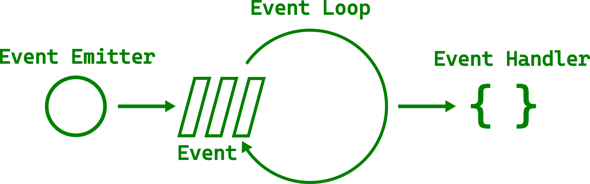

# 主事件循环

我们现在已经能自如地使用回调了，但它们究竟是如何工作的呢？ 所有这些都是异步发生的，因此必须有一个东西来管理事件和调度响应。 不出所料，这就是所谓的主事件循环。

<div style="text-align:center"></div>

主循环管理各种事件——从鼠标点击、键盘按下到文件事件。 所有这些工作都在同一线程内完成。 在所有任务之间快速迭代会给人一种并行的错觉。 这就是为什么你可以在进度条增长的同时移动窗口。

不过，你肯定见过图形界面无响应，至少有几秒钟是这样。 当单个任务耗时过长时，就会出现这种情况。 下面的示例使用  [`std::thread::sleep`](https://doc.rust-lang.org/std/thread/fn.sleep.html) 来表示一个长时间运行的任务。

文件名：<a class=file-link href="https://github.com/gtk-rs/gtk4-rs/blob/master/book/listings/main_event_loop/1/main.rs">listings/main_event_loop/1/main.rs</a>

```rust
{{#rustdoc_include ../listings/main_event_loop/1/main.rs}}
```

按下按钮后，界面会完全冻结五秒钟。 我们甚至无法移动窗口。 调用`sleep`是一个人为的例子，但我们经常希望一次性运行一个时间稍长的操作。


<div style="text-align:center">
 <video autoplay muted loop>
  <source src="vid/main_event_loop_1.webm" type="video/webm">
  <p>A video which shows that after pressing the button, the window can still be moved</p>
 </video>
</div>


## 如何避免阻塞主循环

为了避免阻塞主循环，我们可以使用 [`gio::spawn_blocking`](https://gtk-rs.org/gtk-rs-core/stable/latest/docs/gio/fn.spawn_blocking.html) 生成一个新任务，让操作在线程池中运行。

文件名：<a class=file-link href="https://github.com/gtk-rs/gtk4-rs/blob/master/book/listings/main_event_loop/2/main.rs">listings/main_event_loop/2/main.rs</a>

```rust
{{#rustdoc_include ../listings/main_event_loop/2/main.rs:callback}}
```

现在，当我们按下按钮时，界面不会冻结。 但是，每按一次按钮就会生成一个新任务。 这不一定是我们想要的。

<div style="text-align:center">
 <video autoplay muted loop>
  <source src="vid/main_event_loop_2.webm" type="video/webm">
  <p>A video which shows that after pressing the button, the window can still be moved</p>
 </video>
</div>


> 如果你来自 Rust 之外的其他语言，那么在考虑其他选项之前，你可能会对在独立线程中运行任务的想法感到不舒服。 幸运的是，Rust 的安全保证让你不再担心并发会带来令人讨厌的错误。

## 通道

通常，我们希望跟踪任务中的工作。 在我们的例子中，我们不希望用户在现有任务仍在运行时产生额外的任务。 为了与任务交换信息，我们可以使用 [`async-channel`](https://docs.rs/async-channel/latest/async_channel/index.html) 创建一个通道。 让我们在终端执行以下命令来添加它：

```
cargo add async-channel
```

我们要发送一个 `bool` 值，以告知是否希望按钮对点击做出反应。 由于我们在单独的线程中发送，因此可以使用  [`send_blocking`](https://docs.rs/async-channel/latest/async_channel/struct.Sender.html#method.send_blocking). 那接收呢？ 每次收到消息时，我们都想根据收到的 `bool` 设置按钮的灵敏度。 但是，我们不想在等待接收消息时阻塞主循环。 毕竟这才是整个练习的重点！

我们通过在一个异步([`async`](https://rust-lang.github.io/async-book/))代码块中等待消息来解决这个问题。 这个异步代码块在 `glib` 主循环中使用  [`spawn_future_local`](https://gtk-rs.org/gtk-rs-core/stable/latest/docs/glib/fn.spawn_future_local.html) 生成。

> 另请参阅  [`spawn_future`](https://gtk-rs.org/gtk-rs-core/stable/latest/docs/glib/fn.spawn_future.html) ，从主线程外在主循环上生成异步代码块。

文件名：<a class=file-link href="https://github.com/gtk-rs/gtk4-rs/blob/master/book/listings/main_event_loop/3/main.rs">listings/main_event_loop/3/main.rs</a>

```rust
{{#rustdoc_include ../listings/main_event_loop/3/main.rs:callback}}
```

正如你所看到的，生成一个任务仍然不会冻结我们的用户界面。 不过，现在我们无法同时启动多个任务，因为在启动第一个任务后，按钮就变得不敏感了。 任务完成后，按钮又会变得敏感。

<div style="text-align:center">
 <video autoplay muted loop>
  <source src="vid/main_event_loop_3.webm" type="video/webm">
  <p>The button now stops being responsive for 10 seconds after being pressed</p>
 </video>
</div>

如果任务本质上是异步的怎么办？ 让我们尝试用 [`glib::timeout_future_seconds`](https://gtk-rs.org/gtk-rs-core/stable/latest/docs/glib/fn.timeout_future_seconds.html) 代替 `std::thread::sleep` 来表示我们的任务。 它返回一个 [`std::future::Future`](https://doc.rust-lang.org/std/future/trait.Future.html)，这意味着我们可以在异步上下文中等待它。 转换后的代码在外观和行为上与多线程代码非常相似。

文件名：<a class=file-link href="https://github.com/gtk-rs/gtk4-rs/blob/master/book/listings/main_event_loop/4/main.rs">listings/main_event_loop/4/main.rs</a>

```rust
{{#rustdoc_include ../listings/main_event_loop/4/main.rs:callback}}
```

由于我们又是单线程运行，我们甚至可以不需要通道并实现相同结果。

文件名：<a class=file-link href="https://github.com/gtk-rs/gtk4-rs/blob/master/book/listings/main_event_loop/5/main.rs">listings/main_event_loop/5/main.rs</a>

```rust
{{#rustdoc_include ../listings/main_event_loop/5/main.rs:callback}}
```

但我们为什么不在多线程示例中做同样的事情呢？

```rust ,no_run,compile_fail
# use std::{thread, time::Duration};
# 
# use glib::{clone, MainContext, PRIORITY_DEFAULT};
# use gtk::{glib, gio};
# use gtk::prelude::*;
# use gtk::{Application, ApplicationWindow, Button};
# 
# fn main() {
#     // Create a new application
#     let app = Application::builder()
#        .application_id("org.gtk_rs.MainEventLoop6")
#        .build();
#
#     // Connect to "activate" signal
#     app.connect_activate(build_ui);
# 
#     // Get command-line arguments
#     let args: Vec<String> = args().collect();
#     // Run the application
#     app.run(&args);
# }
# 
# // When the application is launched…
# fn build_ui(application: &Application) {
#     // Create a window
#     let window = ApplicationWindow::builder()
#         .application(application)
#         .title("My GTK App")
#         .build();
# 
#     // Create a button
#     let button = Button::builder()
#         .label("Press me!")
#         .margin_top(12)
#         .margin_bottom(12)
#         .margin_start(12)
#         .margin_end(12)
#         .build();
# 
    // DOES NOT COMPILE!
    // Connect to "clicked" signal of `button`
    button.connect_clicked(move |button| {
        button.clone();
        // The long running operation runs now in a separate thread
        gio::spawn_blocking(move || {
            // Deactivate the button until the operation is done
            button.set_sensitive(false);
            let five_seconds = Duration::from_secs(5);
            thread::sleep(five_seconds);
            // Activate the button again
            button.set_sensitive(true);
        });
    });
# 
#     // Add button
#     window.set_child(Some(&button));
#     window.present();
# }
```

原因很简单，因为我们会收到这样的错误信息：

```console
error[E0277]: `NonNull<GObject>` cannot be shared between threads safely

help: within `gtk4::Button`, the trait `Sync` is not implemented for `NonNull<GObject>`
```

经过循环引用后，我们发现了 GTK GObjects 的第二个缺点： 它们不是线程安全的。

## 在 `async` 上下文中嵌入阻塞调用

在前面的代码片段中，我们已经看到在 `glib` 主循环中生成一个 `async` 块或 `async` future 比在独立线程上运行任务能带来更简洁的代码。 在 gtk-rs 应用中执行 `async` 函数时，我们还可以关注一些有趣的方面。 

首先，阻塞函数可以嵌入 `async` 上下文中。 在下面的列表中，我们要执行一个同步函数，该函数返回一个布尔值，运行时间为 10 秒。 为了将其集成到 `async` 代码块中，我们通过 `spawn_blocking` 在单独的线程中运行该函数。 然后，我们可以在 `spawn_blocking` 的返回值上调用 `await` 来获取函数的返回值。

文件名：<a class=file-link href="https://github.com/gtk-rs/gtk4-rs/blob/master/book/listings/main_event_loop/6/main.rs">listings/main_event_loop/6/main.rs</a>

```rust
{{#rustdoc_include ../listings/main_event_loop/6/main.rs:callback}}
```

## 从外部 crate 运行异步函数

`glib` 生态系统中的异步函数总是可以在 `glib` 主循环中生成。 通常情况下，依赖于 `async-std` 或 `smol` 的 crate 也可以工作。 以 `ashpd` 为例，它允许沙箱应用程序与桌面交互。 默认情况下，它依赖于 `async-std`。 我们可以通过运行以下命令将其添加到我们的依赖中。

```
cargo add ashpd --features gtk4
```

您需要使用 Linux 桌面环境才能在本地运行下面的示例。 此示例使用  [`ashpd::desktop::account::UserInformation`](https://docs.rs/ashpd/latest/ashpd/desktop/account/index.html) 访问用户信息。 我们从按钮获取一个 [`gtk::Native`](https://gtk-rs.org/gtk4-rs/stable/latest/docs/gtk4/struct.Native.html) 对象，创建一个 [`ashp::WindowIdentifier`](https://docs.rs/ashpd/latest/ashpd/enum.WindowIdentifier.html) 并将其传递给用户信息请求。

> 我们需要通过 `WindowIdentifier` 使对话框成为模态对话框。 这意味着对话框将位于窗口顶部，并冻结应用程序的其他部分，不让用户输入。

Filename: <a class=file-link href="https://github.com/gtk-rs/gtk4-rs/blob/master/book/listings/main_event_loop/7/main.rs">listings/main_event_loop/7/main.rs</a>

```rust
{{#rustdoc_include ../listings/main_event_loop/7/main.rs:callback}}
```

按下按钮后，会打开一个对话框，显示将要共享的信息。 如果您决定共享，您的用户名将被打印在控制台上。

<div style="text-align:center"></div>

## Tokio

[`tokio`](https://docs.rs/tokio/latest/tokio/) 是 Rust 最流行的异步平台。 因此，许多高质量的 crate 都是其生态系统的一部分。 网络客户端 [`reqwest`](https://docs.rs/reqwest/latest/reqwest/) 就属于这一类。 让我们执行以下命令来添加它

```
cargo add reqwest@0.12 --features rustls-tls --no-default-features
```

一旦按下按钮，我们就会向 www.gtk-rs.org 发送 `GET` 请求。 然后通过通道将响应发送到主线程。

文件名：<a class=file-link href="https://github.com/gtk-rs/gtk4-rs/blob/master/book/listings/main_event_loop/8/main.rs">listings/main_event_loop/8/main.rs</a>

```rust
{{#rustdoc_include ../listings/main_event_loop/8/main.rs:callback}}
```

编译正常，甚至似乎可以运行。 但是，当我们按下按钮时却什么也没发生。 检查控制台时发现了以下错误信息：

```
thread 'main' panicked at
'there is no reactor running, must be called from the context of a Tokio 1.x runtime'
```

在撰写本文时，`reqwest` 没有说明这一要求。 不幸的是，其他依赖 `tokio` 的库也是如此。 让我们咬咬牙，添加 `tokio`：

```
cargo add tokio@1 --features rt-multi-thread
```

由于我们已经在主线程上运行了 `glib` 主循环，因此我们不想在主线程上运行 `tokio` 运行时。 因此，我们要避免使用 `#[tokio::main]` 宏或顶级 `block_on` 调用。 这样做会阻塞运行时的一个线程与 GLib 主循环，既浪费资源，又可能产生奇怪的 bug。

相反，我们将 [`tokio::runtime::Runtime`](https://docs.rs/tokio/latest/tokio/runtime/struct.Runtime.html) 与静态变量绑定。

```rust
#use std::sync::OnceLock;
#
#use glib::clone;
#use gtk::glib;
#use gtk::prelude::*;
#use gtk::{Application, ApplicationWindow, Button};
#use tokio::runtime::Runtime;
#
#const APP_ID: &str = "org.gtk_rs.MainEventLoop0";
#
// DOES NOT COMPILE!
static RUNTIME: Runtime =
    Runtime::new().expect("Setting up tokio runtime needs to succeed.");
#
#fn main() -> glib::ExitCode {
#    // Create a new application
#    let app = Application::builder().application_id(APP_ID).build();
#
#    // Connect to "activate" signal of `app`
#    app.connect_activate(build_ui);
#
#    // Run the application
#    app.run()
#}
#
#fn build_ui(app: &Application) {
#    // Create a button
#    let button = Button::builder()
#        .label("Press me!")
#        .margin_top(12)
#        .margin_bottom(12)
#        .margin_start(12)
#        .margin_end(12)
#        .build();
#
#    // ANCHOR: callback
#    let (sender, receiver) = async_channel::bounded(1);
#    // Connect to "clicked" signal of `button`
#    button.connect_clicked(move |_| {
#        RUNTIME.spawn(clone!(#[strong] sender, async move {
#            let response = reqwest::get("https://www.gtk-rs.org").await;
#            sender.send(response).await.expect("The channel needs to be open.");
#        }));
#    });
#
#    // The main loop executes the asynchronous block
#    glib::spawn_future_local(async move {
#        while let Ok(response) = receiver.recv().await {
#            if let Ok(response) = response {
#                println!("Status: {}", response.status());
#            } else {
#                println!("Could not make a `GET` request.");
#            }
#        }
#    });
#    // ANCHOR_END: callback
#
#    // Create a window
#    let window = ApplicationWindow::builder()
#        .application(app)
#        .title("My GTK App")
#        .child(&button)
#        .build();
#
#    // Present window
#    window.present();
#}
```

不幸的是，它无法编译。 和往常一样，Rust 的错误信息非常有用。

```
cannot call non-const fn `tokio::runtime::Runtime::new` in statics
calls in statics are limited to constant functions, tuple structs and tuple variants
consider wrapping this expression in `Lazy::new(|| ...)` from the `once_cell` crate
```

我们可以直接遵循建议，但标准库也提供了相应的解决方案。 使用  [`std::sync::OnceLock`](https://doc.rust-lang.org/stable/std/sync/struct.OnceLock.html) 时，我们可以使用常函数 `OnceLock::new()` 初始化静态变量，并在函数 `runtime` 首次调用时初始化。


文件名：<a class=file-link href="https://github.com/gtk-rs/gtk4-rs/blob/master/book/listings/main_event_loop/9/main.rs">listings/main_event_loop/9/main.rs</a>

```rust
{{#rustdoc_include ../listings/main_event_loop/9/main.rs:tokio_runtime}}
```

在按钮回调中，我们现在可以使用 `tokio` 而不是 `glib` 来生成 `reqwest` `async` 代码块。

文件名：<a class=file-link href="https://github.com/gtk-rs/gtk4-rs/blob/master/book/listings/main_event_loop/9/main.rs">listings/main_event_loop/9/main.rs</a>

```rust
{{#rustdoc_include ../listings/main_event_loop/9/main.rs:callback}}
```

如果我们现在按下按钮，就会在控制台中看到以下信息：

```
Status: 200 OK
```

在接下来的章节中，我们将不再需要 `tokio`、`reqwest` 或 `ashpd`，因此让我们再次执行删除操作：

```
cargo remove tokio reqwest ashpd
```

如何确定能否在 `glib` 主循环中生成`async` 任务？当调用的函数来自以下库时，`glib` 应该能够生成任务：

- 来自 `glib` 生态系统，
- 不依赖运行时，只依赖 `futures` 系列 crate (`futures-io`, `futures-core` 等等),
- 依赖于 `async-std` 或 `smol` 运行时，或
- 具有 cargo features 依赖于 `async-std`/`smol` 而不是 `tokio`.


## 结论

您不希望阻塞主线程足够长的时间，以至于用户察觉不到。 但是，什么时候应该执行异步任务，而不是在单独的线程中执行任务呢？ 让我们再来看看不同的情况。

如果任务将时间花在计算上，而不是等待网络响应，那么它就是计算密集型([CPU-bound](https://en.wikipedia.org/wiki/CPU-bound)). 这意味着你必须在一个单独的线程中运行任务，并让它通过一个通道发送结果。

如果您的任务是IO密集型([IO bound](https://en.wikipedia.org/wiki/I/O_bound)), 那么答案取决于您可以使用的 crate 和需要完成的工作类型。

-  使用 `glib`、`smol`、`async-std` 或 `futures` trait 系列 crates 函数的轻量级 I/O 工作可以在主循环中启动。 这样，通常就能避免通过通道进行同步。
- 在独立线程/异步执行器中运行繁重的 I/O 工作仍可避免主循环饱和。 如果您不确定，建议进行基准测试。

如果工作的最佳 crate 依赖于 `tokio`，则必须使用 tokio 运行时生成它，并通过通道进行通信。
