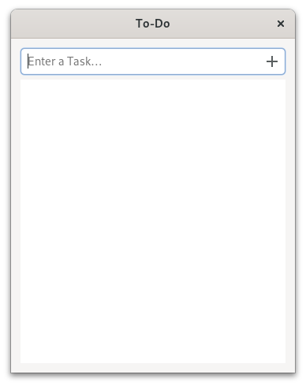

# 创建一个简单的待办事项应用

在我们学习了这么多概念之后，终于到了付诸实践的时候了。 我们要制作一个待办事项应用程序！

目前，我们只需制作一个最小版本即可。 一个输入新任务的输入框和一个显示任务的列表视图就足够了。 类似这样：

<div style="text-align:center"></div>

## 窗口

这个模型可以用下面的复合模板来描述。

文件：<a class=file-link href="https://github.com/gtk-rs/gtk4-rs/blob/master/book/listings/todo/1/resources/window.ui">listings/todo/1/resources/window.ui</a>

```xml
{{#rustdoc_include ../listings/todo/1/resources/window.ui}}
```

为了使用复合模板，我们创建了一个自定义控件。 它的父类是 `gtk::ApplicationWindow`，因此我们继承自它。 像往常一样，我们必须列出除了 `GObject` 和 `GInitiallyUnowned` 之外的所有[祖先](https://docs.gtk.org/gtk4/class.ApplicationWindow.html#ancestors)和[接口](https://docs.gtk.org/gtk4/class.ApplicationWindow.html#implements)。

文件名：<a class=file-link href="https://github.com/gtk-rs/gtk4-rs/blob/master/book/listings/todo/1/window/mod.rs">listings/todo/1/window/mod.rs</a>

```rust
{{#rustdoc_include ../listings/todo/1/window/mod.rs:glib_wrapper}}
```

然后初始化 `imp::Window` 的复合模板。 我们存储输入框(entry)、列表视图(list view)和列表模型(list model)的引用。 这将在我们以后为窗口添加方法时派上用场。 之后，我们将添加用于初始化复合模板的典型模板。 我们只需确保 `window.ui` 中模板的 `class` 属性与 `NAME` 匹配即可。

文件名：<a class=file-link href="https://github.com/gtk-rs/gtk4-rs/blob/master/book/listings/todo/1/window/imp.rs">listings/todo/1/window/imp.rs</a>

```rust
{{#rustdoc_include ../listings/todo/1/window/imp.rs:struct_and_subclass}}
```

`main.rs` 也没有什么新东西。

文件名：<a class=file-link href="https://github.com/gtk-rs/gtk4-rs/blob/master/book/listings/todo/1/main.rs">listings/todo/1/main.rs</a>

```rust
{{#rustdoc_include ../listings/todo/1/main.rs:main}}
```

最后，我们指定资源。 这里已经包含了 `task_row.ui`，我们将在本章稍后处理。

文件名：<a class=file-link href="https://github.com/gtk-rs/gtk4-rs/blob/master/book/listings/todo/1/resources/resources.gresource.xml">listings/todo/1/resources/resources.gresource.xml</a>

```xml
{{#rustdoc_include ../listings/todo/1/resources/resources.gresource.xml}}
```


## 任务对象

目前还不错。 主用户界面已经完成，但输入框还不能对输入做出反应。 另外，输入内容会放在哪里呢？ 我们甚至还没有建立列表模型。 让我们开始吧！

<div style="text-align:center"></div>

正如在[列表部件一章](./list_widgets.html)中所讨论的，我们首先要创建一个自定义 GObject。 该对象将存储任务的状态，其中包括：

- 一个布尔值用于描述任务是否完成
- 一个字符串存储任务名称

文件名：<a class=file-link href="https://github.com/gtk-rs/gtk4-rs/blob/master/book/listings/todo/1/task_object/mod.rs">listings/todo/1/task_object/mod.rs</a>

```rust
{{#rustdoc_include ../listings/todo/1/task_object/mod.rs:glib_wrapper_and_new}}
```

与列表一章不同的是，状态存储在一个结构体中，而不是 `imp::TaskObject` 的单个成员中。 这对于在后续章节中保存状态非常方便。

文件名：<a class=file-link href="https://github.com/gtk-rs/gtk4-rs/blob/master/book/listings/todo/1/task_object/mod.rs">listings/todo/1/task_object/mod.rs</a>

```rust
{{#rustdoc_include ../listings/todo/1/task_object/mod.rs:task_data}}
```

我们将把 `completed` 和 `content` 作为属性公开。 由于数据现在是在一个结构体中，而不是在单个成员变量中，因此我们必须添加更多注解。 对于每个属性，我们都要额外指定名称、类型和要访问的 `TaskData` 成员变量。

文件名：<a class=file-link href="https://github.com/gtk-rs/gtk4-rs/blob/master/book/listings/todo/1/task_object/imp.rs">listings/todo/1/task_object/imp.rs</a>

```rust
{{#rustdoc_include ../listings/todo/1/task_object/imp.rs:struct_and_subclass}}
```

## 任务行

下面我们来看看各个任务。 任务的行应该是这样的：


<div style="text-align:center"></div>

同样，我们用一个复合模板来描述模型。


文件名：<a class=file-link href="https://github.com/gtk-rs/gtk4-rs/blob/master/book/listings/todo/1/resources/task_row.ui">listings/todo/1/resources/task_row.ui</a>

```xml
{{#rustdoc_include ../listings/todo/1/resources/task_row.ui}}
```

在这个代码中，我们用  `gtk:Box` [实现](https://docs.gtk.org/gtk4/class.Box.html#hierarchy) `TaskRow`：

文件名：<a class=file-link href="https://github.com/gtk-rs/gtk4-rs/blob/master/book/listings/todo/1/task_row/mod.rs">listings/todo/1/task_row/mod.rs</a>

```rust
{{#rustdoc_include ../listings/todo/1/task_row/mod.rs:glib_wrapper}}
```

在 `imp::TaskRow` 中，我们保存了 `completed_button` 和 `content_label` 的引用。 我们还存储了绑定的可变vector。 当我们把 `TaskObject` 的状态绑定到相应的 `TaskRow` 时，就会明白为什么需要这样做了。


文件名：<a class=file-link href="https://github.com/gtk-rs/gtk4-rs/blob/master/book/listings/todo/1/task_row/imp.rs">listings/todo/1/task_row/imp.rs</a>

```rust
{{#rustdoc_include ../listings/todo/1/task_row/imp.rs:struct_and_subclass}}
```

现在我们可以将所有内容整合在一起。 我们重写 `imp::Window::constructed`，以便在创建窗口时设置窗口内容。

文件名：<a class=file-link href="https://github.com/gtk-rs/gtk4-rs/blob/master/book/listings/todo/1/window/imp.rs">listings/todo/1/window/imp.rs</a>

```rust
{{#rustdoc_include ../listings/todo/1/window/imp.rs:constructed}}
```

由于我们需要经常访问列表模型，为此我们添加了便捷方法 `Window::tasks`. 在 `Window::setup_tasks` 中，我们创建了一个新模型。 然后在 `imp::Window` 和 `gtk::ListView` 中存储对模型的引用。

文件名：<a class=file-link href="https://github.com/gtk-rs/gtk4-rs/blob/master/book/listings/todo/1/window/mod.rs">listings/todo/1/window/mod.rs</a>

```rust
{{#rustdoc_include ../listings/todo/1/window/mod.rs:tasks}}
```

我们还创建了一个方法 `new_task`，它可以获取条目的内容、清除条目并使用内容创建新任务。

文件名：<a class=file-link href="https://github.com/gtk-rs/gtk4-rs/blob/master/book/listings/todo/1/window/mod.rs">listings/todo/1/window/mod.rs</a>

```rust
{{#rustdoc_include ../listings/todo/1/window/mod.rs:new_task}}
```

在 `Window::setup_callbacks` 中，我们连接到输入框的 "activate"（激活）信号。 当我们在输入框中按下回车键时，就会触发该信号。 然后会创建一个包含内容的新 `TaskObject`，并将其附加到模型中。 最后，输入框将被清空。

文件名：<a class=file-link href="https://github.com/gtk-rs/gtk4-rs/blob/master/book/listings/todo/1/window/mod.rs">listings/todo/1/window/mod.rs</a>

```rust
{{#rustdoc_include ../listings/todo/1/window/mod.rs:setup_callbacks}}
```
`gtk::ListView` 的列表元素是由一个工厂生产的。 在继续实现之前，让我们退一步思考一下我们期望的行为。 我们还希望 `TaskRow` 的 `completed_button` 跟随 `TaskObject` 的 `completed`。 这可以通过类似于列表一章中的表达式来实现。

但是，如果我们切换 `TaskRow` 的 `completed_button` 的状态，`TaskObject` 的 `completed` 也应随之改变。 遗憾的是，表达式无法处理双向关系。 这意味着我们必须使用属性绑定。 当不再需要时，我们需要手动解除绑定。

我们将在 `Window::setup_factory` 的"设置(setup)"步骤中创建空的 `TaskRow` 对象，并在"绑定(bind)"和"解除绑定(unbind)"步骤中处理绑定问题。

文件名：<a class=file-link href="https://github.com/gtk-rs/gtk4-rs/blob/master/book/listings/todo/1/window/mod.rs">listings/todo/1/window/mod.rs</a>

```rust
{{#rustdoc_include ../listings/todo/1/window/mod.rs:setup_factory}}
```

在 `TaskRow::bind` 中绑定属性的工作原理与前几章相同。 唯一不同的是，我们将绑定存储在一个vector(vector)中。 这一点很有必要，因为当您滚动列表时，任务行( `TaskRow` )会被重复使用。 这意味着随着时间的推移，任务行需要绑定到一个新的任务对象，并且必须从旧的任务对象中解除绑定。 只有在能访问存储的 [`glib::Binding`](https://gtk-rs.org/gtk-rs-core/stable/latest/docs/glib/struct.Binding.html) 时，解除绑定才会起作用。

文件名：<a class=file-link href="https://github.com/gtk-rs/gtk4-rs/blob/master/book/listings/todo/1/task_row/mod.rs">listings/todo/1/task_row/mod.rs</a>

```rust
{{#rustdoc_include ../listings/todo/1/task_row/mod.rs:bind}}
```

`TaskRow::unbind` 负责清理工作。 它会遍历 vector 并解除每个绑定。 最后，它会清除该 vector.

文件名：<a class=file-link href="https://github.com/gtk-rs/gtk4-rs/blob/master/book/listings/todo/1/task_row/mod.rs">listings/todo/1/task_row/mod.rs</a>

```rust
{{#rustdoc_include ../listings/todo/1/task_row/mod.rs:unbind}}
```

就这样，我们创建了一个基本的待办事项应用程序！ 在接下来的章节中，我们将添加其他功能以对其进行扩展。

<div style="text-align:center">
 <video autoplay muted loop>
  <source src="vid/todo_1_animation.webm" type="video/webm">
  <p>A video which shows how to enter tasks to the To-Do app</p>
 </video>
</div>
