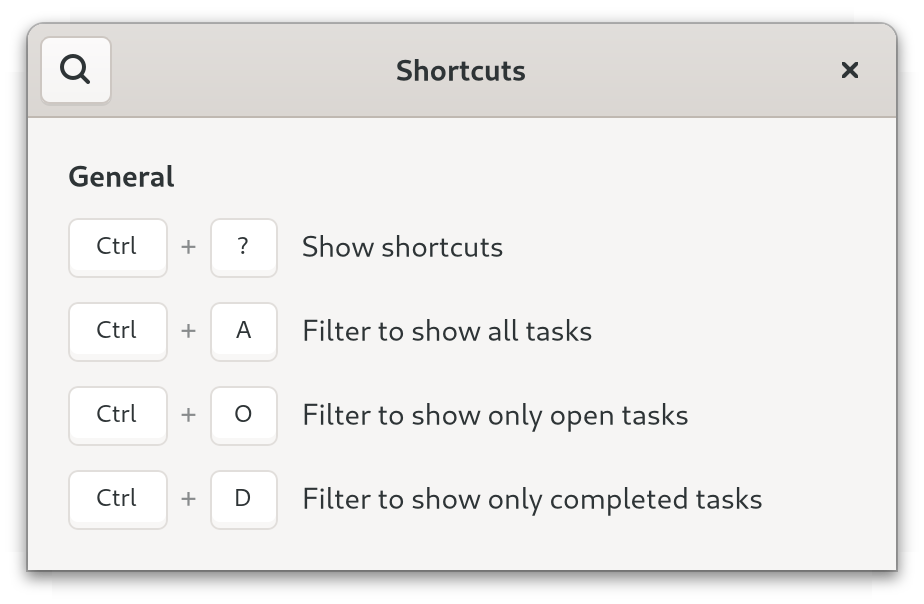

# 控制待办事项应用的状态

## 过滤任务

现在是继续开发待办事项应用的时候了。 一个值得添加的功能是：过滤任务。 这是一个利用我们新学到的关于 Action 的知识的好机会！ 使用 Action，我们可以通过菜单和键盘快捷键访问过滤器。 这就是我们希望的最终效果：

<div style="text-align:center">
 <video autoplay muted loop>
  <source src="vid/todo_2_animation.webm" type="video/webm">
  <p>A video which shows a more featureful To-Do app/p>
 </video>
</div>
请注意，屏幕录像还显示了一个标签为"清除(Clear)"的按钮，它将删除所有已完成的任务。 当我们以后让应用程序在不同会话之间保存任务时，这个按钮就会派上用场。

让我们先在 `window.ui` 中添加菜单和标题栏。 在阅读了[动作](actions.html)一章后，我们应该会对添加的代码感到熟悉。

文件名：<a class=file-link href="https://github.com/gtk-rs/gtk4-rs/blob/master/book/listings/todo/2/resources/window.ui">listings/todo/2/resources/window.ui</a>

```diff
 <?xml version="1.0" encoding="UTF-8"?>
 <interface>
+  <menu id="main-menu">
+    <submenu>
+      <attribute name="label" translatable="yes">_Filter</attribute>
+      <item>
+        <attribute name="label" translatable="yes">_All</attribute>
+        <attribute name="action">win.filter</attribute>
+        <attribute name="target">All</attribute>
+      </item>
+      <item>
+        <attribute name="label" translatable="yes">_Open</attribute>
+        <attribute name="action">win.filter</attribute>
+        <attribute name="target">Open</attribute>
+      </item>
+      <item>
+        <attribute name="label" translatable="yes">_Done</attribute>
+        <attribute name="action">win.filter</attribute>
+        <attribute name="target">Done</attribute>
+      </item>
+    </submenu>
+    <item>
+      <attribute name="label" translatable="yes">_Remove Done Tasks</attribute>
+      <attribute name="action">win.remove-done-tasks</attribute>
+    </item>
+    <item>
+      <attribute name="label" translatable="yes">_Keyboard Shortcuts</attribute>
+      <attribute name="action">win.show-help-overlay</attribute>
+    </item>
+  </menu>
   <template class="TodoWindow" parent="GtkApplicationWindow">
     <property name="width-request">360</property>
     <property name="title" translatable="yes">To-Do</property>
+    <child type="titlebar">
+      <object class="GtkHeaderBar">
+        <child type="end">
+          <object class="GtkMenuButton" id="menu_button">
+            <property name="icon-name">open-menu-symbolic</property>
+            <property name="menu-model">main-menu</property>
+          </object>
+        </child>
+      </object>
+    </child>
```

然后，我们创建一个设置 schema。 同样，"过滤器"设置与菜单调用的有状态的动作（Action）相对应。

文件名：<a class=file-link href="https://github.com/gtk-rs/gtk4-rs/blob/master/book/listings/todo/2/org.gtk_rs.Todo2.gschema.xml">listings/todo/2/org.gtk_rs.Todo2.gschema.xml</a>

```xml
{{#rustdoc_include ../listings/todo/2/org.gtk_rs.Todo2.gschema.xml}}
```

我们按照[设置](./settings.html)一章中的描述安装 schema. 然后，我们将`设置(settings)`的引用添加到 `imp::Window`.

文件名：<a class=file-link href="https://github.com/gtk-rs/gtk4-rs/blob/master/book/listings/todo/2/window/imp.rs">listings/todo/2/window/imp.rs</a>

```rust
{{#rustdoc_include ../listings/todo/2/window/imp.rs:struct_default}}
```

同样，我们创建了一些函数，以方便访问设置。

文件名：<a class=file-link href="https://github.com/gtk-rs/gtk4-rs/blob/master/book/listings/todo/2/window/mod.rs">listings/todo/2/window/mod.rs</a>

```rust
{{#rustdoc_include ../listings/todo/2/window/mod.rs:settings}}
```

我们还为 `TaskObject` 添加了 `is_completed`、`task_data` 和 `from_task_data` 方法。 我们将在下面的代码段中使用它们。

文件名：<a class=file-link href="https://github.com/gtk-rs/gtk4-rs/blob/master/book/listings/todo/2/task_object/mod.rs">listings/todo/2/task_object/mod.rs</a>

```rust
{{#rustdoc_include ../listings/todo/2/task_object/mod.rs:impl}}
```

与前一章类似，我们让`设置(settings)`创建动作。 然后，我们将新创建的动作"过滤器(filter)"添加到窗口中。

文件名：<a class=file-link href="https://github.com/gtk-rs/gtk4-rs/blob/master/book/listings/todo/2/window/mod.rs">listings/todo/2/window/mod.rs</a>

```rust
{{#rustdoc_include ../listings/todo/2/window/mod.rs:setup_actions}}
```

我们还添加了一个动作，允许我们删除已完成的任务。 这次我们使用另一种名为 [`install_action`](https://gtk-rs.org/gtk4-rs/stable/latest/docs/gtk4/subclass/widget/trait.WidgetClassExt.html#method.install_action) 的方法。 这种方法有一些限制。 它只能在子类化部件时使用，而且不支持有状态的动作。 但是，它的用法很简洁，而且有一个相应的姊妹方法 [`install_action_async`](https://gtk-rs.org/gtk4-rs/stable/latest/docs/gtk4/subclass/widget/trait.WidgetClassExt.html#method.install_action_async)，我们将在以后的章节中使用它。

文件名：<a class=file-link href="https://github.com/gtk-rs/gtk4-rs/blob/master/book/listings/todo/2/window/imp.rs">listings/todo/2/window/imp.rs</a>

```rust
{{#rustdoc_include ../listings/todo/2/window/imp.rs:object_subclass}}
```

这是 `remove_done_tasks` 的实现。 我们遍历 `gio::ListStore` 并删除所有已完成的任务对象。

文件名：<a class=file-link href="https://github.com/gtk-rs/gtk4-rs/blob/master/book/listings/todo/2/window/mod.rs">listings/todo/2/window/mod.rs</a>

```rust
{{#rustdoc_include ../listings/todo/2/window/mod.rs:remove_done_tasks}}
```

激活 "win.filter" 操作后，相应的设置将被更改。 因此我们需要一个方法，将此设置转换为 [`gtk::FilterListModel`](https://gtk-rs.org/gtk4-rs/stable/latest/docs/gtk4/struct.FilterListModel.html) 可以理解的过滤器。 可能的状态有 "全部"、"待办"和 "已完成"。 对于 "待办"和 "已完成"，我们返回 `Some(filter)` 。 如果状态为 "全部"，则无需过滤任何内容，因此我们返回 `None`.

文件名：<a class=file-link href="https://github.com/gtk-rs/gtk4-rs/blob/master/book/listings/todo/2/window/mod.rs">listings/todo/2/window/mod.rs</a>

```rust
{{#rustdoc_include ../listings/todo/2/window/mod.rs:filter}}
```

现在，我们可以设置模型了。 通过调用 `filter` 方法，用设置中的状态初始化 `filter_model`。 每当关键字 "filter" 的状态发生变化时，我们就会再次调用 `filter` 方法来获取更新后的 `filter_model`.

文件名：<a class=file-link href="https://github.com/gtk-rs/gtk4-rs/blob/master/book/listings/todo/2/window/mod.rs">listings/todo/2/window/mod.rs</a>

```rust
{{#rustdoc_include ../listings/todo/2/window/mod.rs:setup_tasks}}
```

然后，我们使用 `set_accels_for_action` 将快捷方式与其动作绑定。 这里也使用了详细的动作名称。 由于这必须在应用程序级别完成，`setup_shortcuts` 将 `gtk::Application` 作为参数。

文件名：<a class=file-link href="https://github.com/gtk-rs/gtk4-rs/blob/master/book/listings/todo/2/main.rs">listings/todo/2/main.rs</a>

```rust
{{#rustdoc_include ../listings/todo/2/main.rs:main}}
```

现在，我们创建了所有这些漂亮的快捷方式，我们希望用户能找到它们。 为此，我们需要创建一个快捷方式窗口。 我们再次使用一个 `ui` 文件来描述它，但这里我们不想使用它作为我们自定义控件模板。 相反，我们用它实例化了一个现有类 [`gtk::ShortcutsWindow`](https://gtk-rs.org/gtk4-rs/stable/latest/docs/gtk4/struct.ShortcutsWindow.html)  的控件。


文件名：<a class=file-link href="https://github.com/gtk-rs/gtk4-rs/blob/master/book/listings/todo/2/resources/shortcuts.ui">listings/todo/2/resources/shortcuts.ui</a>

```xml
{{#rustdoc_include ../listings/todo/2/resources/shortcuts.ui}}
```

这些条目可以用 [`gtk::ShortcutsSection`](https://gtk-rs.org/gtk4-rs/stable/latest/docs/gtk4/struct.ShortcutsSection.html) 和 [`gtk::ShortcutsGroup`](https://gtk-rs.org/gtk4-rs/stable/latest/docs/gtk4/struct.ShortcutsGroup.html) 来组织。 如果我们指定了动作名称，我们就不必重复键盘快键键。 [`gtk::ShortcutsShortcut`](https://gtk-rs.org/gtk4-rs/stable/latest/docs/gtk4/struct.ShortcutsShortcut.html) 会自行查找。


> 请注意我们为 `ShortcutsShortcut` 设置 `action-name` 的方式。 我们没有为目标使用单独的属性，而是使用了一个*详细*的操作名称。 详细名称看上去类似： `action_group.action_name(target)`. 目标的格式取决于其类型，此处有[相关说明](https://gtk-rs.org/gtk-rs-core/stable/latest/docs/gio/struct.Action.html#method.parse_detailed_name)。 尤其是字符串，必须用单引号括起来，如本例所示。

最后，我们必须将 `shortcuts.ui` 添加到资源中。 请注意，我们给它起的别名是 `gtk/help-overlay.ui`. 这样做是为了利用[此处](https://gtk-rs.org/gtk4-rs/stable/latest/docs/gtk4/struct.Application.html#automatic-resources)记录的一个便利功能。 它将在 `gtk/help-overlay.ui` 中查找资源，该资源定义了一个 ID 为 `help_overlay` 的`快捷方式窗口(ShortcutsWindow)`。 如果能找到，它将创建一个操作 `win.show-help-overlay` 来显示该窗口，并将快捷键  <kbd>Ctrl</kbd> + <kbd>?</kbd> 与之关联。

文件名：<a class=file-link href="https://github.com/gtk-rs/gtk4-rs/blob/master/book/listings/todo/2/resources/resources.gresource.xml">listings/todo/2/resources/resources.gresource.xml</a>

```xml
{{#rustdoc_include ../listings/todo/2/resources/resources.gresource.xml}}
```

<div style="text-align:center"></div>


## 保存和恢复任务

由于我们使用的是`设置(Settings)`，因此我们的过滤器状态将在会话之间持续存在。 但是，任务本身不会。 让我们来实现这一点。 我们可以将任务存储在`设置`中，但这样会很不方便。 说到序列化和反序列化，没有什么比 [`serde`](https://lib.rs/crates/serde)更好的了。 结合 [`serde_json`](https://lib.rs/crates/serde_json)，我们可以将任务保存为序列化的 [json](https://en.wikipedia.org/wiki/JSON) 文件。

首先，我们使用 `serde` 和 `serde_json` crate 扩展 `Cargo.toml`.

```
cargo add serde --features derive
cargo add serde_json
```

文件名：<a class=file-link href="https://github.com/gtk-rs/gtk4-rs/blob/master/book/listings/Cargo.toml">listings/Cargo.toml</a>

```toml
[dependencies]
serde = { version = "1.0", features = ["derive"] }
serde_json = "1.0"
```

Serde 是一个用于序列化和反序列化 Rust 数据结构的框架。 通过`派生（derive）`功能，我们只需一行代码就能使我们的结构（去）序列化。 我们还使用了 `rc` 功能，这样 Serde 就能处理 `std::rc::Rc` 对象。 这就是为什么我们将 `TodoObject` 的数据存储在一个不同的 `TodoData` 结构中。 这样我们就可以为 `TodoData` 派生出`序列化(Serialize)`和`反序列化(Deserialize)`.

文件名：<a class=file-link href="https://github.com/gtk-rs/gtk4-rs/blob/master/book/listings/todo/2/task_object/mod.rs">listings/todo/2/task_object/mod.rs</a>

```rust
{{#rustdoc_include ../listings/todo/2/task_object/mod.rs:task_data}}
```

我们计划将数据存储为文件，因此我们创建了一个工具函数，为我们提供合适的文件路径。 我们使用 [`glib::user_config_dir`](https://gtk-rs.org/gtk-rs-core/stable/latest/docs/glib/fn.user_config_dir.html) 获取配置目录的路径，并为应用程序创建一个新的子目录。 然后返回文件路径。

文件名：<a class=file-link href="https://github.com/gtk-rs/gtk4-rs/blob/master/book/listings/todo/2/utils.rs">listings/todo/2/utils.rs</a>

```rust
{{#rustdoc_include ../listings/todo/2/utils.rs:data_path}}
```

我们重写了 `close_request` 虚函数，以便在窗口关闭时保存任务。 为此，我们首先遍历所有条目并将其存储在一个 `Vec` 中。 然后将 `Vec` 序列化，并将数据存储为 json 文件。

文件名：<a class=file-link href="https://github.com/gtk-rs/gtk4-rs/blob/master/book/listings/todo/2/window/imp.rs">listings/todo/2/window/imp.rs</a>

```rust
{{#rustdoc_include ../listings/todo/2/window/imp.rs:window_impl}}
```

让我们来看看 `Vec<TaskData>` 将被序列化成什么样子。 请注意，[`serde_json::to_writer`](https://docs.serde.rs/serde_json/fn.to_writer.html) 会以更简洁但可读性更差的方式保存数据。 若要创建等价但格式友好的 json，只需将 `to_writer` 替换为  [`serde_json::to_writer_pretty`](https://docs.serde.rs/serde_json/fn.to_writer_pretty.html).

文件名：data.json

```json
[
  {
    "completed": true,
    "content": "Task Number Two"
  },
  {
    "completed": false,
    "content": "Task Number Five"
  },
  {
    "completed": true,
    "content": "Task Number Six"
  },
  {
    "completed": false,
    "content": "Task Number Seven"
  },
  {
    "completed": false,
    "content": "Task Number Eight"
  }
]
```

当我们启动应用程序时，我们希望恢复已保存的数据。 让我们为此添加一个 `restore_data` 方法。 我们将确保处理启动时没有数据文件的情况。 这可能是我们第一次启动应用程序，因此没有以前的会话可以恢复。

文件名：<a class=file-link href="https://github.com/gtk-rs/gtk4-rs/blob/master/book/listings/todo/2/window/mod.rs">listings/todo/2/window/mod.rs</a>

```rust
{{#rustdoc_include ../listings/todo/2/window/mod.rs:restore_data}}
```

最后，我们要确保一切在 `constructed` 中配置好。

文件名：<a class=file-link href="https://github.com/gtk-rs/gtk4-rs/blob/master/book/listings/todo/2/window/imp.rs">listings/todo/2/window/imp.rs</a>

```rust
{{#rustdoc_include ../listings/todo/2/window/imp.rs:object_impl}}

```
我们的待办事项应用突然变得更有用了。 我们不仅可以过滤任务，还可以在会话之间保留任务。
