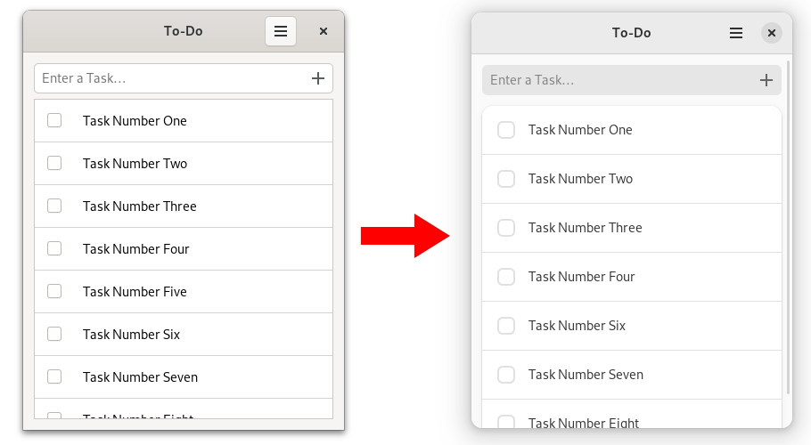
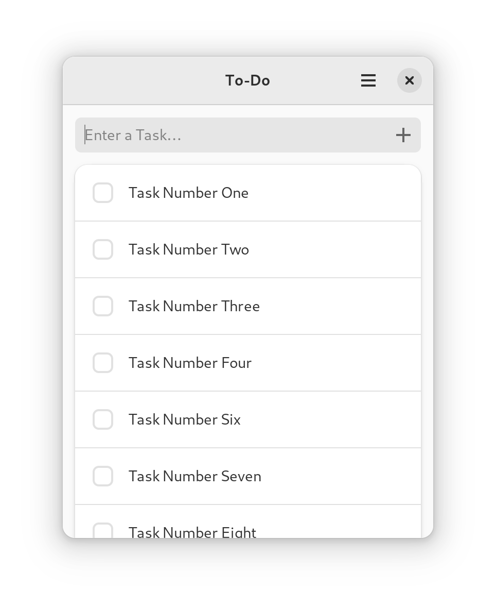

# 让待办事项应用使用 Libadwaita

在本章中，我们将调整待办事项应用程序，使其遵循 GNOME 的 [HIG](https://developer.gnome.org/hig/). 首先，让我们安装 Libadwaita，并将 `libadwaita` crate 添加到我们的依赖关系中，如[上一章](libadwaita.html)所述。

使用 Libadwaita 的最简单方法是将 [`gtk::Application`](https://gtk-rs.org/gtk4-rs/stable/latest/docs/gtk4/struct.Application.html) 替换为 [`adw::Application`](https://world.pages.gitlab.gnome.org/Rust/libadwaita-rs/stable/latest/docs/libadwaita/struct.Application.html).

文件名： <a class=file-link href="https://github.com/gtk-rs/gtk4-rs/blob/master/book/listings/todo/5/main.rs">listings/todo/5/main.rs</a>

```rust,no_run,noplayground
{{#rustdoc_include ../listings/todo/5/main.rs:main}}
```

文件名： <a class=file-link href="https://github.com/gtk-rs/gtk4-rs/blob/master/book/listings/todo/5/window/mod.rs">listings/todo/5/window/mod.rs</a>

```rust,no_run,noplayground
{{#rustdoc_include ../listings/todo/5/window/mod.rs:new}}
```

`adw::Application` 在内部调用 [`adw::init`](https://world.pages.gitlab.gnome.org/Rust/libadwaita-rs/stable/latest/docs/libadwaita/functions/fn.init.html)，确保为 Libadwaita 正确设置翻译、类型、样式表和图标。 只要命名[正确]([Application in libadwaita - Rust](https://world.pages.gitlab.gnome.org/Rust/libadwaita-rs/stable/latest/docs/libadwaita/struct.Application.html#automatic-resources))，它还会自动从资源中加载样式表。

看看我们的待办事项应用，我们可以发现其控件的外观发生了变化。 这是因为 GTK 提供的`默认`样式表已被 Libadwaita 提供的 `Adwaita` 样式表所取代。

<div style="text-align:center"></div>

此外，我们的应用现在可以与系统一起切换到暗黑风格。

<div style="text-align:center">
 <video autoplay muted loop>
  <source src="vid/todo_dark.webm" type="video/webm">
   <p>A video which shows how the To-Do app changes color scheme from light to dark</p>
 </video>
</div>

## Boxed lists

当然，Libadwaita 不仅仅是几个样式表和一个[`样式管理器`](https://world.pages.gitlab.gnome.org/Rust/libadwaita-rs/stable/latest/docs/libadwaita/struct.StyleManager.html)。 但在我们进入有趣的内容之前，我们将用 `adw::prelude` 和 `adw::subclass::prelude` 替换所有出现的[`adw::prelude`](https://world.pages.gitlab.gnome.org/Rust/libadwaita-rs/stable/latest/docs/libadwaita/prelude/index.html) 和 [`adw::subclass::prelude`](https://world.pages.gitlab.gnome.org/Rust/libadwaita-rs/stable/latest/docs/libadwaita/subclass/prelude/index.html)，让我们的未来生活更轻松。 这是因为 `adw` prelude 除了 Libadwaita 特有的 trait 外，还重新导出了相应的 `gtk` prelude。

现在，我们要让我们的任务项采用 [boxed lists pattern](https://developer.gnome.org/hig/patterns/containers/boxed-lists.html). HIG 并不要求我们使用这种样式，这是有原因的：它与循环列表不兼容。 这意味着它们不能与 [list views]([List &amp; Column Views - GNOME Human Interface Guidelines](https://developer.gnome.org/hig/patterns/containers/list-column-views.html)) 一起使用，因此只适用于相对较小的列表。

> 尝试用代码添加任务，看看需要添加多少个任务才能使用户界面明显变慢。 自己判断一下这个数字是否合理，或者我们是否应该坚持使用列表视图。

我们可以使用 [`gtk::ListBox`](https://gtk-rs.org/gtk4-rs/stable/latest/docs/gtk4/struct.ListBox.html) 代替 [`gtk::ListView`](https://gtk-rs.org/gtk4-rs/stable/latest/docs/gtk4/struct.ListView.html) 来使用 boxed lists. 我们还将添加 Libadwaita 提供的[`boxed-list`](https://gnome.pages.gitlab.gnome.org/libadwaita/doc/main/boxed-lists.html)样式类。

让我们在 `window.ui` 文件中实现所有这些更改。 所有更改都限制在 `ApplicationWindow` 的第二个子对象中。 要查看完整文件，只需点击"文件名"后面的链接。

文件名： <a class=file-link href="https://github.com/gtk-rs/gtk4-rs/blob/master/book/listings/todo/6/resources/window.ui">listings/todo/6/resources/window.ui</a>

```xml
<child>
  <object class="GtkScrolledWindow">
    <property name="hscrollbar-policy">never</property>
    <property name="min-content-height">420</property>
    <property name="vexpand">True</property>
    <property name="child">
      <object class="AdwClamp">
        <property name="child">
          <object class="GtkBox">
            <property name="orientation">vertical</property>
            <property name="spacing">18</property>
            <property name="margin-top">24</property>
            <property name="margin-bottom">24</property>
            <property name="margin-start">12</property>
            <property name="margin-end">12</property>
            <child>
              <object class="GtkEntry" id="entry">
                <property name="placeholder-text" translatable="yes">Enter a Task…</property>
                <property name="secondary-icon-name">list-add-symbolic</property>
              </object>
            </child>
            <child>
              <object class="GtkListBox" id="tasks_list">
                <property name="visible">False</property>
                <property name="selection-mode">none</property>
                <style>
                  <class name="boxed-list" />
                </style>
              </object>
            </child>
          </object>
        </property>
      </object>
    </property>
  </object>
</child>
```

为了遵循 boxed list 模式，我们改用了 [`gtk::ListBox`](https://gtk-rs.org/gtk4-rs/stable/latest/docs/gtk4/struct.ListBox.html), 将其属性 "selection-mode"设置为 "none"，并添加了`boxed-list`样式类。

让我们继续查看 `window/imp.rs`. 成员变量 `tasks_list` 现在描述的是 `ListBox` 而不是 `ListView`.

文件名： <a class=file-link href="https://github.com/gtk-rs/gtk4-rs/blob/master/book/listings/todo/6/window/imp.rs">listings/todo/6/window/imp.rs</a>

```rust,no_run,noplayground
{{#rustdoc_include ../listings/todo/6/window/imp.rs:window}}
```

现在我们转到 `window/mod.rs`. `ListBox` 可以很好地支持模型(model)，但在没有任何控件回收的情况下，我们不再需要工厂。 `setup_factory` 可以被安全地删除。要设置 `ListBox`，我们需要在 `setup_tasks` 中调用 `bind_model`. 在这里，我们指定了模型，以及描述如何将给定的 GObject 转换为 list box 可以显示的控件的闭包。

文件名： <a class=file-link href="https://github.com/gtk-rs/gtk4-rs/blob/master/book/listings/todo/6/window/mod.rs">listings/todo/6/window/mod.rs</a>

```rust,no_run,noplayground
{{#rustdoc_include ../listings/todo/6/window/mod.rs:bind_model}}
```

我们仍然需要指定 `create_task_row` 方法。 在这里，我们创建了一个以 [`gtk::CheckButton`](https://gtk-rs.org/gtk4-rs/stable/latest/docs/gtk4/struct.CheckButton.html) 作为可激活控件的 [`adw::ActionRow`](https://world.pages.gitlab.gnome.org/Rust/libadwaita-rs/stable/latest/docs/libadwaita/struct.ActionRow.html). 如果没有回收，GObject 将始终属于同一个控件。 这意味着我们可以直接绑定它们的属性，而不必担心以后会取消绑定。

文件名： <a class=file-link href="https://github.com/gtk-rs/gtk4-rs/blob/master/book/listings/todo/6/window/mod.rs">listings/todo/6/window/mod.rs</a>

```rust,no_run,noplayground
{{#rustdoc_include ../listings/todo/6/window/mod.rs:create_task_row}}
```

使用 boxed lists 时，还必须注意在没有任务时隐藏 `ListBox`. 

文件名： <a class=file-link href="https://github.com/gtk-rs/gtk4-rs/blob/master/book/listings/todo/6/window/mod.rs">listings/todo/6/window/mod.rs</a>

```rust,no_run,noplayground
{{#rustdoc_include ../listings/todo/6/window/mod.rs:connect_items_changed}}
```

最后，我们定义了 `set_task_list_visible` 方法。

文件名： <a class=file-link href="https://github.com/gtk-rs/gtk4-rs/blob/master/book/listings/todo/6/window/mod.rs">listings/todo/6/window/mod.rs</a>

```rust,no_run,noplayground
{{#rustdoc_include ../listings/todo/6/window/mod.rs:set_task_list_visible}}
```

这就是 boxed list 样式在我们应用程序中的样子。

<div style="text-align:center"></div>
