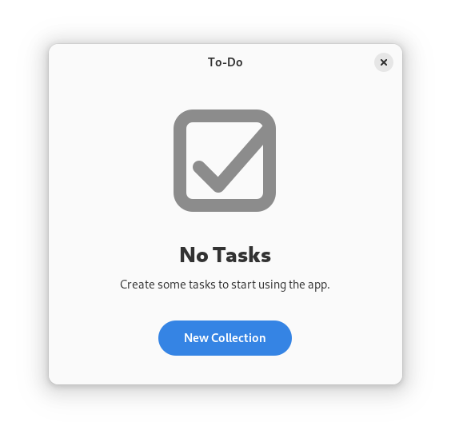

# 添加收藏夹

## 侧边栏

仅仅使用 Libadwaita ，待办事项应用的外观和感觉方面已经有了一个很大的飞跃。 让我们更进一步，添加一种将任务分组为收藏夹的方法。 这些集合将在应用程序的左侧获得自己的边栏。 首先，我们添加一个没有任何功能的空白侧边栏。

<div style="text-align:center"></div>

要达到这种状态，我们需要经过几个步骤。 首先，我们必须用 [`adw::ApplicationWindow`](https://world.pages.gitlab.gnome.org/Rust/libadwaita-rs/stable/latest/docs/libadwaita/struct.ApplicationWindow.html)  替换 [`gtk::ApplicationWindow`](https://gtk-rs.org/gtk4-rs/stable/latest/docs/gtk4/struct.ApplicationWindow.html). 两者的主要区别在于 `adw::ApplicationWindow` 没有标题栏区域。 当我们使用 [`adw::NavigationSplitView`](https://world.pages.gitlab.gnome.org/Rust/libadwaita-rs/stable/latest/docs/libadwaita/struct.NavigationSplitView.html) 构建界面时，这就派上了用场。 在上面的截图中，`NavigationSplitView` 为左边的收藏夹视图添加了一个侧边栏，而任务视图则占据了右边的空间。 使用 `adw::ApplicationWindow` 时，集合视图和任务视图都有各自的 [`adw::HeaderBar`](https://world.pages.gitlab.gnome.org/Rust/libadwaita-rs/stable/latest/docs/libadwaita/struct.HeaderBar.html)栏，而分隔线则穿过整个窗口。

文件名： <a class=file-link href="https://github.com/gtk-rs/gtk4-rs/blob/master/book/listings/todo/7/resources/window.ui">listings/todo/7/resources/window.ui</a>

```xml
<?xml version="1.0" encoding="UTF-8"?>
<interface>
  <menu id="main-menu">
    <!--Menu implementation-->      
  </menu>
  <template class="TodoWindow" parent="AdwApplicationWindow">
    <property name="title" translatable="yes">To-Do</property>
    <property name="width-request">360</property>
    <property name="height-request">200</property>
    <child>
      <object class="AdwBreakpoint">
        <condition>max-width: 500sp</condition>
        <setter object="split_view" property="collapsed">True</setter>
      </object>
    </child>
    <property name="content">
      <object class="AdwNavigationSplitView" id="split_view">
        <property name="min-sidebar-width">200</property>
        <property name="sidebar">
          <object class="AdwNavigationPage">
            <!--Collection view implementation-->
          </object>
        </property>
        <property name="content">
          <object class="AdwNavigationPage">
            <!--Task view implementation-->
          </object>
        </property>
      </object>
    </property>
  </template>
</interface>
```

`NavigationSplitView` 还有助于使您的应用程序具有[自适应能力](https://developer.gnome.org/hig/guidelines/adaptive.html)。一旦请求的大小太小，无法同时容纳所有子视图，分割视图就会折叠，并开始像 [`gtk::Stack`](https://gtk-rs.org/gtk4-rs/stable/latest/docs/gtk4/struct.Stack.html) 那样工作。 这意味着它一次只能显示一个子视图。 仅显示单张的自适应行为允许待办事项应用在较小屏幕尺寸（如手机）上运行，即使添加了收藏夹视图。

<div style="text-align:center">
 <video autoplay muted loop>
  <source src="vid/todo_7_navigation_sidebar.webm" type="video/webm">
   <p>A video which shows that reduzing the width of the app let's the sidebar collapse</p>
 </video>
</div>

我们为收藏夹视图添加了必要的用户界面元素，如带有添加新收藏夹按钮的标题栏，以及稍后显示收藏的列表框 `collections_list`. 我们还为 `collections_list` 添加了[导航侧边栏(navigations-sidebar)](https://gnome.pages.gitlab.gnome.org/libadwaita/doc/1-latest/style-classes.html#sidebars)样式。

文件名： <a class=file-link href="https://github.com/gtk-rs/gtk4-rs/blob/master/book/listings/todo/7/resources/window.ui">listings/todo/7/resources/window.ui</a>

```xml
<object class="AdwNavigationPage">
  <property name="title" bind-source="TodoWindow"
    bind-property="title" bind-flags="sync-create" />
  <property name="child">
    <object class="AdwToolbarView">
      <child type="top">
        <object class="AdwHeaderBar">
          <child type="start">
            <object class="GtkToggleButton">
              <property name="icon-name">list-add-symbolic</property>
              <property name="tooltip-text" translatable="yes">New Collection</property>
              <property name="action-name">win.new-collection</property>
            </object>
          </child>
        </object>
      </child>
      <property name="content">
        <object class="GtkScrolledWindow">
          <property name="child">
            <object class="GtkListBox" id="collections_list">
              <style>
                <class name="navigation-sidebar" />
              </style>
            </object>
          </property>
        </object>
      </property>
    </object>
```

我们还为任务视图添加了标题栏。

文件名： <a class=file-link href="https://github.com/gtk-rs/gtk4-rs/blob/master/book/listings/todo/7/resources/window.ui">listings/todo/7/resources/window.ui</a>

```xml
<object class="AdwNavigationPage">
  <property name="title" translatable="yes">Tasks</property>
  <property name="child">
    <object class="AdwToolbarView">
      <child type="top">
        <object class="AdwHeaderBar">
          <property name="show-title">False</property>
          <child type="end">
            <object class="GtkMenuButton">
              <property name="icon-name">open-menu-symbolic</property>
              <property name="menu-model">main-menu</property>
              <property name="tooltip-text" translatable="yes">Main Menu</property>
            </object>
          </child>
        </object>
      </child>
      <property name="content">
        <object class="GtkScrolledWindow">
          <property name="child">
            <object class="AdwClamp">
              <property name="maximum-size">400</property>
              <property name="tightening-threshold">300</property>
              <property name="child">
                <object class="GtkBox">
                  <property name="orientation">vertical</property>
                  <property name="margin-start">12</property>
                  <property name="margin-end">12</property>
                  <property name="spacing">12</property>
                  <child>
                    <object class="GtkEntry" id="entry">
                      <property name="placeholder-text" translatable="yes">Enter a Task…</property>
                      <property name="secondary-icon-name">list-add-symbolic</property>
                    </object>
                  </child>
                  <child>
                    <object class="GtkListBox" id="tasks_list">
                      <property name="visible">False</property>
                      <property name="selection-mode">none</property>
                      <style>
                        <class name="boxed-list" />
                      </style>
                    </object>
                  </child>
                </object>
              </property>
            </object>
          </property>
        </object>
      </property>
    </object>
  </property>
</object>
```

我们还必须调整窗口的实现。 例如，我们窗口的父类型现在是 `adw::ApplicationWindow`，而不是 `gtk::ApplicationWindow`.

文件名： <a class=file-link href="https://github.com/gtk-rs/gtk4-rs/blob/master/book/listings/todo/7/window/imp.rs">listings/todo/7/window/imp.rs</a>

```rust,no_run,noplayground
{{#rustdoc_include ../listings/todo/7/window/imp.rs:object_subclass}}
```

这也意味着我们必须实现 `AdwApplicationWindowImpl` trait.

文件名： <a class=file-link href="https://github.com/gtk-rs/gtk4-rs/blob/master/book/listings/todo/7/window/imp.rs">listings/todo/7/window/imp.rs</a>

```rust,no_run,noplayground
{{#rustdoc_include ../listings/todo/7/window/imp.rs:adw_application_window_impl}}
```

最后，我们将 `adw::ApplicationWindow` 添加到 `mod.rs `中 `Window` 的祖先中。

文件名： <a class=file-link href="https://github.com/gtk-rs/gtk4-rs/blob/master/book/listings/todo/7/window/mod.rs">listings/todo/7/window/mod.rs</a>

```rust,no_run,noplayground
{{#rustdoc_include ../listings/todo/7/window/mod.rs:glib_wrapper}}
```

## 占位页面（空页面）

在开始填充收藏夹视图之前，我们还应该考虑一个不同的挑战：待办事项应用程序的空状态。 在此之前，没有任何任务的空状态还算不错。 很明显，您必须在输入栏中添加任务。 但现在情况不同了。 用户必须先添加一个收藏夹，我们必须明确这一点。 GNOME HIG 建议为此使用一个[占位页面]([Placeholder Pages - GNOME Human Interface Guidelines](https://developer.gnome.org/hig/patterns/feedback/placeholders.html))。 在我们的例子中，如果用户在没有任何收藏的情况下打开应用程序，这个占位页面就会显示给用户。

<div style="text-align:center"></div>

现在，我们将用户界面封装在 [`gtk::Stack`](https://gtk-rs.org/gtk4-rs/stable/latest/docs/gtk4/struct.Stack.html)中。 一个堆栈页面描述占位页面，另一个描述主页面。 我们稍后将在 Rust 代码中设置显示正确堆栈页面的逻辑。

文件名： <a class=file-link href="https://github.com/gtk-rs/gtk4-rs/blob/master/book/listings/todo/8/resources/window.ui">listings/todo/8/resources/window.ui</a>

```xml
<?xml version="1.0" encoding="UTF-8"?>
<interface>
  <menu id="main-menu">
    <!--Menu implementation--> 
  </menu>
  <template class="TodoWindow" parent="AdwApplicationWindow">
    <property name="title" translatable="yes">To-Do</property>
    <property name="width-request">360</property>
    <property name="height-request">200</property>
    <child>
      <object class="AdwBreakpoint">
        <condition>max-width: 500sp</condition>
        <setter object="split_view" property="collapsed">True</setter>
      </object>
    </child>
    <property name="content">
      <object class="GtkStack" id="stack">
        <property name="transition-type">crossfade</property>
        <child>
          <object class="GtkStackPage">
            <property name="name">placeholder</property>
            <property name="child">
              <object class="GtkBox">
                <!--Placeholder page implementation--> 
              </object>
            </property>
          </object>
        </child>
        <child>
          <object class="GtkStackPage">
            <property name="name">main</property>
            <property name="child">
              <object class="AdwNavigationSplitView" id="split_view">
                <!--Main page implementation-->
              </object>
            </property>
          </object>
        </child>
      </object>
    </property>
  </template>
</interface>
```

为了创建之前显示的分页符页面，我们将扁平标题栏与 [`adw::StatusPage`](https://world.pages.gitlab.gnome.org/Rust/libadwaita-rs/stable/latest/docs/libadwaita/struct.StatusPage.html) 结合起来。

文件名： <a class=file-link href="https://github.com/gtk-rs/gtk4-rs/blob/master/book/listings/todo/8/resources/window.ui">listings/todo/8/resources/window.ui</a>

```xml
<object class="GtkBox">
  <property name="orientation">vertical</property>
  <child>
    <object class="GtkHeaderBar">
      <style>
        <class name="flat" />
      </style>
    </object>
  </child>
  <child>
    <object class="GtkWindowHandle">
      <property name="vexpand">True</property>
      <property name="child">
        <object class="AdwStatusPage">
          <property name="icon-name">checkbox-checked-symbolic</property>
          <property name="title" translatable="yes">No Tasks</property>
          <property name="description" translatable="yes">Create some tasks to start using the app.</property>
          <property name="child">
            <object class="GtkButton">
              <property name="label" translatable="yes">_New Collection</property>
              <property name="use-underline">True</property>
              <property name="halign">center</property>
              <property name="action-name">win.new-collection</property>
              <style>
                <class name="pill" />
                <class name="suggested-action" />
              </style>
            </object>
          </property>
        </object>
      </property>
    </object>
  </child>
</object>
```

## 收藏夹

我们仍然需要一种方法来存储我们的收藏夹。 就像我们已经创建了 `TaskObject` 一样，现在我们将引入 `CollectionObject`. 它将拥有`标题(title)`和`任务(tasks)`两个成员，这两个成员都将作为公开属性。 像往常一样，点击代码片段右上方的眼睛符号可以看到完整的实现。

文件名： <a class=file-link href="https://github.com/gtk-rs/gtk4-rs/blob/master/book/listings/todo/8/collection_object/imp.rs">listings/todo/8/collection_object/imp.rs</a>

```rust,no_run,noplayground
{{#rustdoc_include ../listings/todo/8/collection_object/imp.rs:collection_object}}
```

我们还添加了结构体`收藏夹数据（CollectionData）`，以帮助实现序列化和反序列化。

文件名： <a class=file-link href="https://github.com/gtk-rs/gtk4-rs/blob/master/book/listings/todo/8/collection_object/mod.rs">listings/todo/8/collection_object/mod.rs</a>

```rust,no_run,noplayground
{{#rustdoc_include ../listings/todo/8/collection_object/mod.rs:collection_data}}
```

最后，我们为 `CollectionObject` 添加方法，以便——

- 用 `new` 创建它,
- 用 `tasks` 轻松访问 `ListStore`
- 使用 `to_collection_data` 和 `from_collection_data` 任意转换 `CollectionData`

文件名： <a class=file-link href="https://github.com/gtk-rs/gtk4-rs/blob/master/book/listings/todo/8/collection_object/mod.rs">listings/todo/8/collection_object/mod.rs</a>

```rust,no_run,noplayground
{{#rustdoc_include ../listings/todo/8/collection_object/mod.rs:impl}}
```

## Window

为了连接新的逻辑，我们必须为 `imp::Window` 添加更多状态。 我们可以通过 `template_child` 宏访问额外的控件。 此外，我们还引用了 `collections` 列表存储、`current_collection` 和 `current_filter_model`. 我们还存储了 `tasks_changed_handler_id`. 它的作用将在后面的代码片段中说明。

文件名： <a class=file-link href="https://github.com/gtk-rs/gtk4-rs/blob/master/book/listings/todo/7/window/imp.rs">listings/todo/8/window/imp.rs</a>

```rust,no_run,noplayground
{{#rustdoc_include ../listings/todo/8/window/imp.rs:struct}}
```

此外，我们还添加了几个 Helper 方法，这些方法稍后会派上用场。

文件名： <a class=file-link href="https://github.com/gtk-rs/gtk4-rs/blob/master/book/listings/todo/8/window/imp.rs">listings/todo/8/window/mod.rs</a>

```rust,no_run,noplayground
{{#rustdoc_include ../listings/todo/8/window/mod.rs:helper}}
```

一如既往，我们希望在关闭窗口时保存数据。 由于大部分实现都在 `CollectionObject::to_collection_data` 方法中，因此 `close_request` 的实现并没有太大变化。

文件名： <a class=file-link href="https://github.com/gtk-rs/gtk4-rs/blob/master/book/listings/todo/8/window/imp.rs">listings/todo/8/window/imp.rs</a>

```rust,no_run,noplayground
{{#rustdoc_include ../listings/todo/8/window/imp.rs:window_impl}}
```

`constructed` 也基本保持不变。 我们现在不再使用 `setup_tasks`，而是使用 `setup_collections`. 

文件名： <a class=file-link href="https://github.com/gtk-rs/gtk4-rs/blob/master/book/listings/todo/7/window/imp.rs">listings/todo/8/window/imp.rs</a>

```rust,no_run,noplayground
{{#rustdoc_include ../listings/todo/8/window/imp.rs:object_impl}}
```

`setup_collections` 设置 `collections` 列表存储，并确保模型中的更改会反映在 `collections_list` 中。 为此，它使用 `create_collection_row` 方法。

文件名： <a class=file-link href="https://github.com/gtk-rs/gtk4-rs/blob/master/book/listings/todo/8/window/imp.rs">listings/todo/8/window/mod.rs</a>

```rust,no_run,noplayground
{{#rustdoc_include ../listings/todo/8/window/mod.rs:setup_collections}}
```

`create_collection_row` 获取一个 `CollectionObject` 并根据其信息创建一个 [`gtk::ListBoxRow`](https://gtk-rs.org/gtk4-rs/stable/latest/docs/gtk4/struct.ListBoxRow.html).

文件名： <a class=file-link href="https://github.com/gtk-rs/gtk4-rs/blob/master/book/listings/todo/8/window/imp.rs">listings/todo/8/window/mod.rs</a>

```rust,no_run,noplayground
{{#rustdoc_include ../listings/todo/8/window/mod.rs:create_collection_row}}
```

我们还调整了 `restore_data`. 同样，重头戏来自于 `CollectionObject::from_collection_data`，所以我们不必在这里做太多改动。 由于 `collections_list` 中的行可以被选择，我们必须在还原数据后选择其中之一。 我们选择第一行，然后让 `set_current_collection` 方法完成剩下的工作。

文件名： <a class=file-link href="https://github.com/gtk-rs/gtk4-rs/blob/master/book/listings/todo/8/window/imp.rs">listings/todo/8/window/mod.rs</a>

```rust,no_run,noplayground
{{#rustdoc_include ../listings/todo/8/window/mod.rs:restore_data}}
```

`set_current_collection` 可确保所有访问任务的元素都引用当前收藏夹的任务模型。 我们将 `tasks_list` 与当前收藏夹绑定，并存储过滤模型。 只要当前收藏夹中没有任务，我们就要隐藏任务列表。 否则，列表框会留下一行难看的字。 不过，我们不想在切换集合时累积信号处理器(signal handler)。 这就是为什么我们要存储 `tasks_changed_handler_id`，并在设置新的收藏夹时断开旧的处理器(handler)。 最后，我们选择收藏夹行。

文件名： <a class=file-link href="https://github.com/gtk-rs/gtk4-rs/blob/master/book/listings/todo/8/window/imp.rs">listings/todo/8/window/mod.rs</a>

```rust,no_run,noplayground
{{#rustdoc_include ../listings/todo/8/window/mod.rs:set_current_collection}}
```

之前，我们使用了 `set_task_list_visible` 方法。 该方法确保 `tasks_list` 只有在任务数大于 0 时才可见。

文件名： <a class=file-link href="https://github.com/gtk-rs/gtk4-rs/blob/master/book/listings/todo/8/window/imp.rs">listings/todo/8/window/mod.rs</a>

```rust,no_run,noplayground
{{#rustdoc_include ../listings/todo/8/window/mod.rs:set_task_list_visible}}
```

`select_collection_row` 可确保在 `collections_list` 中选择当前收藏夹的行。

文件名： <a class=file-link href="https://github.com/gtk-rs/gtk4-rs/blob/master/book/listings/todo/8/window/imp.rs">listings/todo/8/window/mod.rs</a>

```rust,no_run,noplayground
{{#rustdoc_include ../listings/todo/8/window/mod.rs:select_collection_row}}
```

## 消息对话

目前还没有添加收藏夹的方法。 让我们来实现这一功能。

<div style="text-align:center">
 <video autoplay muted loop>
  <source src="vid/todo_8_dialog.webm" type="video/webm">
   <p>A video which shows the new dialog</p>
 </video>
</div>

上面的屏幕录像演示了所需的行为。 当我们按下带有 `+` 符号的按钮时，会出现一个对话框。 当输入框为空时，"创建"按钮保持不激活。 一旦我们开始键入，按钮就会激活。 当我们删除所有键入的字母，输入框再次变为空时，"创建"按钮就会变暗，输入框就会变成 "错误" 样式。 点击 "创建" 按钮后，一个新的收藏夹就创建好了，然后我们就可以进入其任务视图。

为了实现这一行为，我们首先要在 `class_init` 方法中添加一个 "new-collection" 动作。 点击 `+` 按钮和占位页面中的按钮都将激活该操作。 我们使用[`install_action_async`](https://gtk-rs.org/gtk4-rs/stable/latest/docs/gtk4/subclass/widget/trait.WidgetClassExt.html#method.install_action_async). 这是一种为子类控件添加异步操作的便捷方法。

文件名： <a class=file-link href="https://github.com/gtk-rs/gtk4-rs/blob/master/book/listings/todo/8/window/imp.rs">listings/todo/8/window/imp.rs</a>

```rust,no_run,noplayground
{{#rustdoc_include ../listings/todo/8/window/imp.rs:object_subclass}}
```

一旦 "new-collection" 操作被激活，`异步(async) new_collection` 方法就会被调用。 在这里，我们创建[`adw::AlertDialog`](https://world.pages.gitlab.gnome.org/Rust/libadwaita-rs/stable/latest/docs/libadwaita/struct.AlertDialog.html), 设置按钮并添加条目。 我们为条目添加了一个回调，以确保内容发生变化时，空内容会将 `dialog_button` 设置为不激活，并为条目添加一个 "错误" CSS 类。 然后，我们`等待(await)`用户按下对话框上的按钮。 如果用户点击 "取消"，我们就返回。 但是，如果他们点击 "创建"，我们就会创建一个新的收藏夹，并将其设置为当前收藏夹。 然后，我们在页面上向前导航，导航到任务视图。

文件名： <a class=file-link href="https://github.com/gtk-rs/gtk4-rs/blob/master/book/listings/todo/8/window/imp.rs">listings/todo/8/window/mod.rs</a>

```rust,no_run,noplayground
{{#rustdoc_include ../listings/todo/8/window/mod.rs:new_collection}}
```

我们还在 `setup_callbacks` 中添加了更多回调。 重要的是，每当 "过滤（filter）"设置的值发生变化时，我们都要过滤当前的任务模型。 每当收藏夹的项目发生变化时，我们也要设置堆栈。 这样可以确保在没有收藏夹的情况下显示占位页面。 最后，我们确保当我们点击 `collections_list` 中的一行时，`current_collection` 将被设置为所选的集合，并分割视图显示任务视图。

文件名： <a class=file-link href="https://github.com/gtk-rs/gtk4-rs/blob/master/book/listings/todo/8/window/imp.rs">listings/todo/8/window/mod.rs</a>

```rust,no_run,noplayground
{{#rustdoc_include ../listings/todo/8/window/mod.rs:setup_callbacks}}
```

之前，我们调用了 `set_stack` 方法。 该方法确保在至少有一个集合时，显示主页面，否则显示"占位"页面。

文件名： <a class=file-link href="https://github.com/gtk-rs/gtk4-rs/blob/master/book/listings/todo/8/window/imp.rs">listings/todo/8/window/mod.rs</a>

```rust,no_run,noplayground
{{#rustdoc_include ../listings/todo/8/window/mod.rs:set_stack}}
```

就是这样！ 现在我们可以欣赏最终成果了。

<div style="text-align:center">
 <video autoplay muted loop>
  <source src="vid/todo_8_adaptive_sidebar.webm" type="video/webm">
   <p>A video which shows the final To-Do app</p>
 </video>
</div>

> 您可能已经注意到，目前还没有删除收藏夹的方法。 请尝试在本地版本的待办事项应用程序中实现这一缺失功能。 您需要考虑哪些边界情况？
